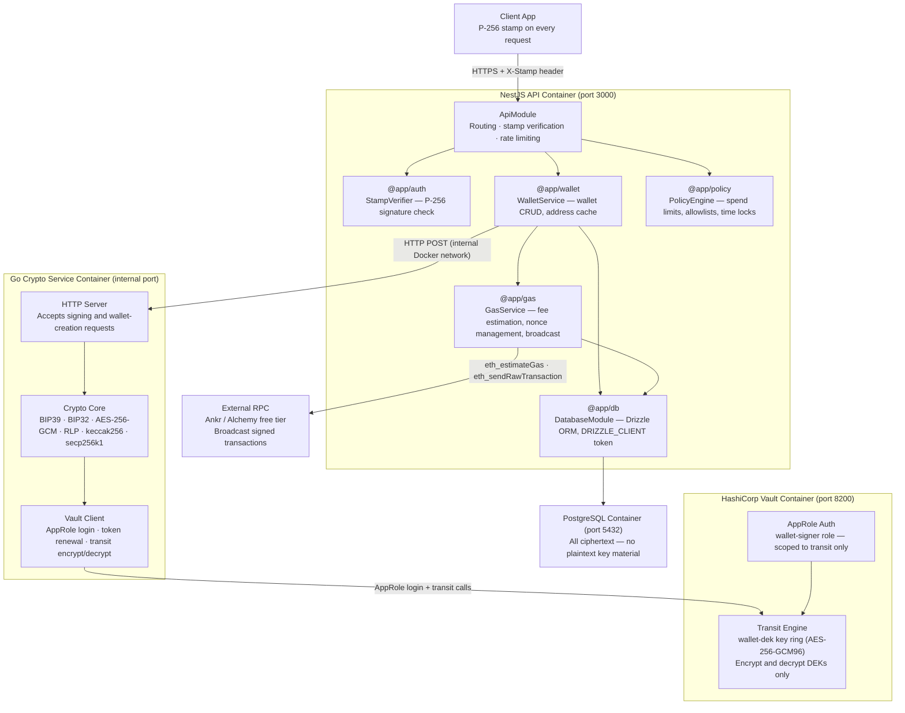

# WalletMVP — Architecture & Module Definitions

This document defines every component in the system, what it does, what it
does not do, and how it communicates with the other components.

---

## High-level architecture diagram



---

## Component definitions

### NestJS API (`apps/api/`)

**What it is:** The main application process. An HTTP server built with NestJS
that handles all client-facing requests.

**What it does:**

- Verifies the P-256 cryptographic stamp on every incoming request
- Routes requests to the correct service (wallet creation, signing, gas, policy)
- Reads and writes all business data to PostgreSQL via Drizzle ORM
- Enforces signing policies before forwarding any signing request to the Go
  crypto service
- Writes to the audit log after every significant event
- Manages nonce sequencing and gas estimation before broadcasting transactions
- Broadcasts signed transactions to the Ethereum network via a free RPC provider

**What it does NOT do:**

- Never generates, decrypts, or touches any key material
- Never holds a Vault token or communicates with Vault directly
- Never sees a plaintext seed, plaintext DEK, or private key

**Libs it owns:** `@app/auth`, `@app/wallet`, `@app/gas`, `@app/policy`, `@app/db`

---

### `@app/db` — DatabaseModule (`libs/db/`)

**What it is:** A NestJS global module that provides a single Drizzle ORM
client, injected everywhere via the `DRIZZLE_CLIENT` symbol token.

**What it does:**

- Defines all nine Drizzle schema tables
- Provides the `DRIZZLE_CLIENT` injection token globally
- Manages the PostgreSQL connection pool

**Tables:** `organizations`, `users`, `api_keys`, `organization_seeds`,
`wallets`, `signing_requests`, `wallet_nonces`, `policies`, `audit_log`

---

### `@app/auth` — StampVerifier (`libs/auth/`)

**What it is:** A NestJS guard that verifies the P-256 cryptographic stamp
on every incoming request.

**What it does:**

- Parses the `X-Stamp` header from every request
- Verifies the P-256 signature over the request body and timestamp
- Rejects requests with invalid, missing, or replayed stamps
- Looks up the API key in Postgres to find the associated public key

**Why stamps:** Turnkey's authentication model. Every request is signed by
the caller's private key. This prevents MITM attacks, request forgery, and
replay attacks even if TLS is terminated upstream.

---

### `@app/wallet` — WalletService (`libs/wallet/`)

**What it is:** The primary business logic layer for wallet and signing operations.

**What it does:**

- Handles wallet creation: calls Go crypto service, stores ciphertext in Postgres
- Handles child wallet derivation: calls Go crypto service with org seed ciphertext;
  `userId` is optional — system wallets (treasury, deployer, etc.) are created without
  a user assignment; `wallets.user_id` is nullable
- Handles signing requests: checks policy, calls Go crypto service, records result
- Manages the wallet address cache (addresses stored in plaintext after first derivation)
- Coordinates with `@app/gas` for nonce and fee management

**What it does NOT do:**

- Never touches plaintext key material — only ciphertext in and out of Postgres
- Does not call Vault

---

### `@app/gas` — GasService (`libs/gas/`)

**What it is:** Transaction assembly and broadcast service.

**What it does:**

- Estimates gas via `eth_estimateGas` on a free RPC provider
- Manages nonce sequences per wallet (reads from `wallet_nonces` table)
- Assembles the raw transaction fields before sending them to the Go signer
- Broadcasts the signed transaction via `eth_sendRawTransaction`
- Updates the nonce table after successful broadcast

---

### `@app/policy` — PolicyEngine (`libs/policy/`)

**What it is:** Rule evaluator that gates every signing request.

**What it does:**

- Evaluates spend limits (per-transaction and rolling window)
- Checks address allowlists and blocklists
- Enforces time locks (e.g. no signing outside business hours)
- Reads policy rules from the `policies` table
- Returns allow/deny decision to WalletService before any signing call

---

### Go Crypto Service (`cmd/crypto/`)

**What it is:** A long-lived Go HTTP server running in its own Docker
container. It is the single cryptographic boundary of the entire system.
All key material — plaintext or ciphertext — is handled exclusively here.

**What it does:**

- Authenticates to Vault independently using its own AppRole credentials
  (`wallet-signer` role) at startup
- Renews its Vault token on a background timer (at ~75% of TTL)
- Handles `POST /wallet/create`: generates BIP39 mnemonic and seed, generates
  a random DEK, AES-256-GCM encrypts the seed, calls Vault to encrypt the DEK,
  derives the first Ethereum address, returns all ciphertext + address to NestJS,
  zeroes all plaintext key material
- Handles `POST /wallet/derive`: receives org seed ciphertext, calls Vault to
  decrypt the DEK, decrypts the seed, derives the child key at the requested
  index, returns the Ethereum address, zeroes all key material
- Handles `POST /wallet/sign`: receives org seed ciphertext + raw transaction
  fields, calls Vault to decrypt the DEK, decrypts the seed, derives the child
  key, RLP-encodes the transaction fields, computes keccak256 hash, signs with
  secp256k1, returns `{ signature, txHash }`, zeroes all key material

**What it does NOT do:**

- Never stores any key material to disk
- Never logs plaintext key material
- Never exposes its HTTP port outside the Docker internal network

**Vault identity:** `wallet-signer` AppRole — policy scoped to
`transit/encrypt/wallet-dek` and `transit/decrypt/wallet-dek` only.

**Communication:** Listens on `CRYPTO_PORT` (env var). Accessible only on
the internal Docker network (`walletmvp-network`). NestJS calls it via
`http://crypto:${CRYPTO_PORT}`.

---

### HashiCorp Vault (`vault/`)

**What it is:** A self-hosted secrets management service running in its own
Docker container. It plays one narrow role: KEK (Key Encryption Key) store.

**What it does:**

- Runs the Transit secrets engine, which provides encrypt and decrypt operations
  on the `wallet-dek` key ring
- The `wallet-dek` key ring holds the KEK — an AES-256-GCM96 key that never
  leaves Vault
- Wraps DEKs (encrypt) when the Go service creates a new wallet
- Unwraps DEKs (decrypt) when the Go service needs to sign or derive
- Authenticates the Go service via AppRole (`wallet-signer` role)
- Writes a tamper-evident audit log of every encrypt/decrypt call to
  `/vault/logs/audit.log`
- Supports key rotation via Transit key versioning (`vault:v1:...`, `vault:v2:...`)

**What it does NOT do:**

- Does not store seeds, private keys, or any wallet data
- Does not communicate with NestJS — only the Go crypto service
- Does not expose any endpoint outside the Docker internal network (except
  port 8200 for local dev UI access)

**Protection model:** The Vault master key is split into 3 Shamir shares
(threshold: 2). Vault is sealed on every restart and must be manually
unsealed with 2 shares. The master key exists only in Vault's memory while
unsealed — never on disk.

---

### PostgreSQL (`postgres/`)

**What it is:** The application database. Stores all business data and
encrypted key material.

**What it does:**

- Stores all nine tables defined in the Drizzle schema
- Holds `encrypted_seed`, `seed_nonce`, and `encrypted_dek` per organization
  — all are ciphertext, never plaintext
- Stores wallet addresses in plaintext (they are public information)
- Holds the append-only audit log

**What it does NOT do:**

- Never holds plaintext seeds, DEKs, or private keys
- A full database breach alone exposes nothing cryptographically useful —
  an attacker would also need to compromise Vault

---

## Communication map

| From              | To                | Protocol                       | What is sent                          |
| ----------------- | ----------------- | ------------------------------ | ------------------------------------- |
| Client            | NestJS API        | HTTPS + X-Stamp                | Signed API requests                   |
| NestJS API        | Go Crypto Service | HTTP (internal Docker network) | Ciphertext + tx fields                |
| Go Crypto Service | HashiCorp Vault   | HTTP (internal Docker network) | AppRole login, encrypt/decrypt calls  |
| NestJS API        | PostgreSQL        | TCP (internal Docker network)  | SQL queries — reads/writes ciphertext |
| NestJS API        | External RPC      | HTTPS                          | Signed raw transactions for broadcast |

**Nothing sensitive crosses the Docker network boundary.** All plaintext key
material exists only inside the Go crypto service process memory, for the
shortest possible duration, and is zeroed immediately after use.

---

## Security boundary summary

```
┌─────────────────────────────────────────────────────┐
│  OUTSIDE: Client, Internet, External RPC            │
│  Only signatures and addresses cross this boundary  │
└───────────────────────┬─────────────────────────────┘
                        │ HTTPS
┌───────────────────────▼─────────────────────────────┐
│  Docker internal network                            │
│                                                     │
│  NestJS API ──(ciphertext only)──► Go Crypto Svc   │
│                                         │           │
│                                    (AppRole)        │
│                                         │           │
│                                    Vault Transit    │
│                                                     │
│  NestJS API ──(SQL)──► PostgreSQL                   │
│  (only ciphertext stored)                           │
└─────────────────────────────────────────────────────┘

Plaintext key material exists ONLY inside the Go Crypto Service
process memory. It never crosses any network boundary.
```
