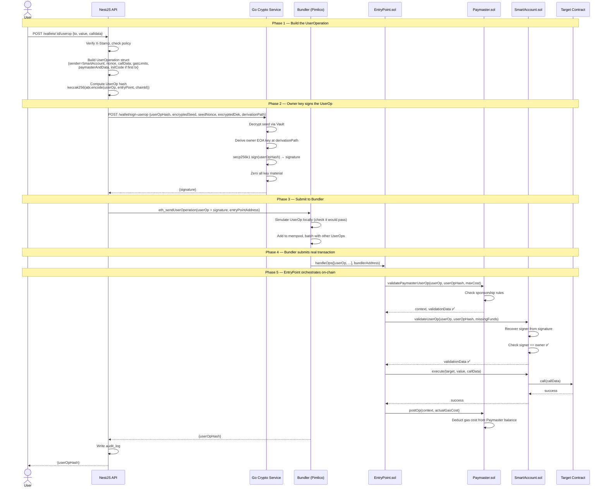
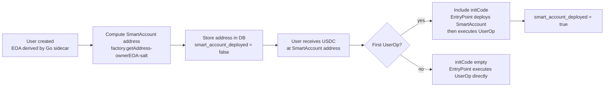

# ERC-4337 & Smart Accounts — WalletMVP Integration Guide

This document explains ERC-4337 from first principles, then maps every concept
onto WalletMVP's existing architecture. Read this before touching any code.

---

## Part 1 — Why EOAs hit a wall

In standard Ethereum, a wallet is an Externally Owned Account (EOA). It has
one private key. Whoever holds that key controls the account. The key signs
transactions. The account pays gas. Those two things — signing and paying gas
— are permanently coupled. There is no way to separate them at the protocol
level for EOAs.

This creates a hard constraint: if a user has no ETH, they cannot transact.
Full stop. Every "gasless" pattern for EOAs (meta-tx, EIP-3009, pre-funding)
is a workaround around this wall, not a solution to it.

ERC-4337 removes the wall entirely by changing what a "wallet" is.

---

## Part 2 — What ERC-4337 actually is

ERC-4337 introduces a new transaction type called a **UserOperation** (often
written UserOp). Instead of sending a transaction directly to Ethereum, the
user sends a UserOp to a **separate off-chain mempool**. A network of actors
called **Bundlers** pick up UserOps, bundle multiple of them together, and
submit one real Ethereum transaction that executes all of them.

The critical shift: **the user's wallet is now a smart contract**, not an EOA.
The smart contract wallet has its own address and holds the user's funds. The
EOA from your Go sidecar becomes the **owner key** of that contract — it
proves intent by signing the UserOp, but it no longer needs to hold ETH
because gas is paid by someone else.

The four actors in ERC-4337 are:

```
UserOperation  →  Bundler  →  EntryPoint  →  SmartAccount  →  Target
```

Let's go through each one.

---

## Part 3 — The four actors explained

### 3.1 The EntryPoint contract

One canonical contract deployed on every EVM chain at a fixed address. It is
the single trusted coordinator of the whole system. The Bundler submits its
batched transaction to the EntryPoint. The EntryPoint then calls each
SmartAccount in sequence, verifying and executing each UserOp.

You do not deploy the EntryPoint. It already exists on Base, Ethereum, and
every major EVM chain. It was audited by OpenZeppelin and is the same address
everywhere: `0x5FF137D4b0FDCD49DcA30c7CF57E578a026d2789`.

Think of EntryPoint as the post office sorting room. Bundlers drop off bags
of mail (batches of UserOps). EntryPoint delivers each letter (UserOp) to the
right address (SmartAccount) and handles payment.

### 3.2 The SmartAccount (ERC-4337 wallet)

This is the user's actual wallet. It is a smart contract deployed on-chain,
one per user. It holds ETH and tokens. It has its own address that never
changes even if the owner key rotates.

The SmartAccount contract implements two mandatory functions:

- `validateUserOp(userOp, userOpHash, missingFunds)` — the EntryPoint calls
  this first. The SmartAccount must verify that the UserOp was signed by its
  owner. If validation passes, the EntryPoint proceeds. If it fails, the
  whole operation is rejected.

- `execute(target, value, calldata)` — after validation passes, the
  EntryPoint calls this to actually do the thing the user wanted (send tokens,
  call a contract, etc.). The SmartAccount acts as the `msg.sender` for this
  call, so any contract it calls sees the SmartAccount address as the caller —
  no ERC-2771 needed.

Your Go sidecar's EOA (the BIP32-derived child key) becomes the **owner** of
this SmartAccount. The SmartAccount's `validateUserOp` checks that the UserOp
signature was produced by that EOA. If the owner key needs to rotate, you
call a function on the SmartAccount to update it — the on-chain address stays
the same.

The standard reference implementation is called **SimpleAccount**, maintained
by the eth-infinitism team (the ERC-4337 authors). OpenZeppelin also ships
one. For learning, SimpleAccount is the right starting point.

### 3.3 The Bundler

A Bundler is an off-chain service (run by you or a third party) that:

1. Accepts UserOperations into its own mempool (separate from Ethereum's regular mempool)
2. Simulates them locally to check they would pass validation
3. Batches multiple UserOps together
4. Submits one real Ethereum transaction to `EntryPoint.handleOps([...userOps])`
5. Pays the gas for that transaction from its own EOA
6. Gets reimbursed by collecting fees that the UserOps declared they would pay

For learning on Base, you do not need to run your own Bundler. Pimlico and
Alchemy both offer free Bundler RPC endpoints. You point your code at their
endpoint instead of a regular RPC and they handle bundling.

### 3.4 The Paymaster (optional but the whole point)

A Paymaster is an optional smart contract that can agree to pay gas on behalf
of users. When a UserOp includes a Paymaster address, the EntryPoint calls
the Paymaster's `validatePaymasterUserOp` function. If the Paymaster agrees
to sponsor this operation, it pays the gas. The user pays nothing.

This is where gasless UX actually comes from. Without a Paymaster, the
SmartAccount itself must hold ETH to cover gas (same problem as before, just
shifted). With a Paymaster, your platform's Paymaster contract pays gas and
you can build whatever sponsorship logic you want: always free, free up to
a monthly limit, free if the user holds your token, etc.

Pimlico, Alchemy, and Biconomy all offer hosted Paymasters for free on
testnets and low cost on mainnets. For learning, you use their Paymaster
and never deploy your own.

---

## Part 4 — The UserOperation struct

A UserOperation is not an Ethereum transaction. It is a data struct that
describes what the user wants to do. It contains:

```
UserOperation {
  sender            address   // the SmartAccount address
  nonce             uint256   // anti-replay nonce managed by EntryPoint
  initCode          bytes     // only on first tx: factory address + calldata to deploy SmartAccount
  callData          bytes     // what the SmartAccount should execute
  callGasLimit      uint256   // gas for the execute() call
  verificationGasLimit uint256 // gas for validateUserOp()
  preVerificationGas   uint256 // overhead gas for bundler
  maxFeePerGas      uint256   // same as EIP-1559
  maxPriorityFeePerGas uint256
  paymasterAndData  bytes     // empty = user pays; Paymaster address + data = sponsored
  signature         bytes     // owner's signature over the UserOp hash
}
```

The key fields to understand:

**`initCode`** — on the very first transaction from a new SmartAccount, the
account does not exist yet. `initCode` contains the factory contract address
plus the calldata to deploy the SmartAccount. The EntryPoint calls the factory
to deploy the account, then proceeds with the UserOp. On all subsequent
transactions, `initCode` is empty — the account already exists.

**`callData`** — this is the ABI-encoded call to `SmartAccount.execute()`.
It encodes the target contract, value, and the actual function call the user
wants to make (e.g. transfer USDC, call your contract, etc.).

**`paymasterAndData`** — if empty, the SmartAccount pays gas from its own
ETH balance. If set to a Paymaster address (plus any data the Paymaster
needs), the Paymaster pays. For gasless UX, this always points to your
Paymaster.

**`signature`** — the owner EOA's signature over the UserOp hash. This is
what your Go sidecar produces. The hash is computed differently than a
regular tx hash — it is `keccak256(abi.encode(userOp fields, entryPointAddress, chainId))`.

---

## Part 5 — The full ERC-4337 flow



---

## Part 6 — How this maps onto WalletMVP's existing architecture

This is the important part. Nothing you have built is thrown away.

### What stays exactly the same

```
Vault + DEK encryption        ✅ unchanged
BIP39/BIP32 seed generation   ✅ unchanged
Go crypto service             ✅ unchanged, gets one new endpoint
Stamp authentication          ✅ unchanged
Policy engine                 ✅ unchanged
PostgreSQL schema             ✅ minor additions only
```

### The mental model shift

Today, the EOA address derived by your Go sidecar IS the user's wallet. With
ERC-4337, the EOA derived by your Go sidecar becomes the **owner key** of a
SmartAccount contract. The SmartAccount address is what you give to users. The
EOA address is internal — it signs UserOps but never appears to end users.

```
TODAY
─────────────────────────────────────────────────────────
  BIP32 child key  →  EOA address  =  User's wallet address
  Go sidecar signs transactions FROM this address
  This address must hold ETH to pay gas

AFTER ERC-4337
─────────────────────────────────────────────────────────
  BIP32 child key  →  EOA address  =  Owner key (internal)
                            ↓
                     SmartAccount.sol  =  User's wallet address
  Go sidecar signs UserOperations WITH this key
  SmartAccount address holds tokens
  Paymaster pays gas — no ETH needed anywhere
```

### The key hierarchy extended

```
Layer 0: Vault KEK
│
└──► Layer 1: DEK (per org)
     │
     └──► Layer 2: BIP39 seed
          │
          └──► BIP32 child EOA key  ←── signs UserOperations
               │
               └──► owns SmartAccount.sol  ←── user's on-chain wallet
                    │                           holds tokens, has address
                    └──► calls Target contracts
```

### New components needed

**SimpleAccountFactory.sol** — a factory contract you deploy once. When a
user needs their SmartAccount for the first time, the factory deploys it with
the user's EOA as the owner. The factory is deterministic — given the same
owner address and salt, it always produces the same SmartAccount address. This
means you can compute the SmartAccount address before it is deployed and give
it to the user immediately (counterfactual deployment).

```
// pseudocode — the factory pattern
factory.getAddress(ownerEOA, salt) → SmartAccountAddress (deterministic)
factory.createAccount(ownerEOA, salt) → deploys SmartAccount if not yet deployed
```

**Paymaster.sol** — a contract your platform funds with ETH. The EntryPoint
calls it to ask "will you pay for this UserOp?" Your Paymaster logic decides
yes/no (could be always yes, could check an allowlist, could check a spending
limit). For MVP: always sponsor. You top up the Paymaster's ETH deposit with
the EntryPoint just like you would top up a relayer.

For learning, you can skip deploying your own Paymaster entirely and use
Pimlico's free verifying Paymaster. You sign a message with your backend key
saying "I approve this UserOp for sponsorship" and Pimlico's Paymaster
verifies that signature on-chain. Zero contract deployment required.

**`POST /wallet/sign-userop` in Go sidecar** — one new endpoint. Takes the
UserOp hash (32 bytes), derives the owner key from the encrypted seed, signs
it with secp256k1, returns the signature. Identical flow to `/wallet/sign`
except instead of signing an RLP-encoded tx hash, it signs a UserOp hash.

**`SmartAccountService` in NestJS** — new lib or addition to WalletService.
Handles: computing the counterfactual SmartAccount address, building the
UserOperation struct, calling Go sidecar for the signature, submitting to the
Bundler RPC, polling for receipt.

### Database changes

Two new columns on the `wallets` table:

- `smart_account_address` — the on-chain SmartAccount address (deterministic,
  computable before deployment)
- `smart_account_deployed` — boolean, false until the first UserOp goes through
  (which triggers deployment via `initCode`)

No changes to `organization_seeds`. No changes to key management. The EOA
address already stored in `wallets.address` becomes the owner key reference.

---

## Part 7 — Counterfactual deployment (no upfront cost)

One of the most elegant properties of ERC-4337: you do not need to deploy
the SmartAccount before the user's first transaction. The factory is
deterministic, so you can compute the SmartAccount address immediately when
a user is created, store it in the database, and give it to them. They can
receive tokens at that address right away.

When the user makes their first transaction, the UserOp includes `initCode`.
The EntryPoint sees `initCode`, calls the factory to deploy the SmartAccount,
then proceeds with the rest of the UserOp — all in one atomic transaction.
The user pays nothing, the Paymaster covers the deployment gas too.



---

## Part 8 — UserOp nonce management

ERC-4337 nonces are managed by the EntryPoint contract, not your database.
The EntryPoint tracks `nonces[sender][key]` on-chain. You read the current
nonce with `entryPoint.getNonce(smartAccountAddress, key)` and increment it
by including the correct value in the UserOp. The EntryPoint enforces
uniqueness — replay is impossible.

This replaces the `wallet_nonces` table for UserOp-based transactions. You
still need the nonce table for any regular EOA transactions you keep supporting.

---

## Part 9 — Gas estimation for UserOps

Gas estimation for UserOps is different from regular transactions. The Bundler
exposes an RPC method `eth_estimateUserOperationGas` that simulates the UserOp
and returns the three gas limits: `callGasLimit`, `verificationGasLimit`, and
`preVerificationGas`. You call this before signing (since the gas limits are
part of the signed struct).

```
pseudocode: building a UserOp

1. Compute smartAccountAddress = factory.getAddress(ownerEOA, salt)
2. Read nonce = entryPoint.getNonce(smartAccountAddress, 0)
3. Encode callData = SmartAccount.execute.encode(target, value, innerCalldata)
4. Set initCode = factory address + createAccount calldata (if first tx, else empty)
5. Set paymasterAndData = paymaster address + paymaster-specific data
6. Call bundler.eth_estimateUserOperationGas(partialUserOp) → gas limits
7. Build final UserOp with all fields
8. Compute userOpHash = keccak256(abi.encode(userOp, entryPoint, chainId))
9. Send userOpHash to Go sidecar → get signature
10. Attach signature to UserOp
11. Submit to bundler.eth_sendUserOperation
```

---

## Part 10 — What you are NOT building (for MVP)

**Your own Bundler** — use Pimlico or Alchemy's free endpoint. Running a
Bundler requires handling mempool management, simulation, gas price strategy,
and MEV protection. Not a learning priority.

**Your own Paymaster** — use Pimlico's verifying Paymaster for learning. You
sign an approval message with a backend key, Pimlico's Paymaster verifies it.
No Solidity needed. Deploy your own Paymaster later if you want to learn that.

**Session keys** — a powerful feature where you issue a temporary limited-scope
key that can sign on behalf of the SmartAccount without the full owner key.
Great for games and DeFi. Post-MVP.

**Social recovery** — nominate guardian addresses that can collectively rotate
the owner key. Post-MVP.

---

## Part 11 — New repository structure

```
apps/
  api/                    unchanged
libs/
  crypto-client/          add signUserOp() method
  wallet/                 add SmartAccountService
  smart-account/          new lib
    src/
      userop-builder.ts   builds UserOperation structs
      bundler-client.ts   wraps Pimlico/Alchemy Bundler RPC (using viem)
      factory.ts          counterfactual address computation
  gas/                    unchanged (still used for legacy EOA txs)
  policy/                 unchanged
  auth/                   unchanged
  db/                     add smart_account columns to wallets table
cmd/
  crypto/                 add POST /wallet/sign-userop handler
contracts/                new top-level directory
  src/
    SimpleAccount.sol     reference implementation (or import from eth-infinitism)
    SimpleAccountFactory.sol
  script/
    Deploy.s.sol          Foundry deploy script
  foundry.toml
```

---

## Part 12 — Deployment order

```
1. Deploy SimpleAccountFactory.sol to Base Sepolia (testnet)
   → save FACTORY_ADDRESS in .env

2. Register with Pimlico
   → get free Bundler RPC URL
   → get free Paymaster RPC URL
   → save BUNDLER_RPC_URL, PAYMASTER_RPC_URL, PIMLICO_API_KEY in .env

3. Add POST /wallet/sign-userop to Go sidecar
   → identical to /wallet/sign but signs a raw 32-byte hash (the userOpHash)
   → no RLP encoding, no tx fields — just sign the hash
   → redeploy Go Docker container

4. Create libs/smart-account/ in NestJS
   → UserOpBuilder, BundlerClient, factory address computation

5. Add POST /wallets/:id/userop endpoint to apps/api
   → stamp verified, policy checked, then builds and submits UserOp

6. On wallet creation (deriveWallet), compute and store SmartAccount address
   → factory.getAddress(ownerEOA, salt=0) → store in wallets.smart_account_address

7. Test end-to-end on Base Sepolia
   → create wallet, get SmartAccount address
   → send USDC to SmartAccount address
   → submit UserOp to transfer USDC to another address
   → confirm gas came from Pimlico Paymaster, not SmartAccount
```

---

## Summary — what changes, what does not

| Component                 | Change                                                   |
| ------------------------- | -------------------------------------------------------- |
| Vault                     | None                                                     |
| BIP39/BIP32               | None                                                     |
| Go crypto service         | Add one endpoint: `/wallet/sign-userop`                  |
| NestJS `@app/auth`        | None                                                     |
| NestJS `@app/policy`      | None                                                     |
| NestJS `@app/gas`         | None (still used for EOA txs)                            |
| NestJS `@app/db`          | Add two columns to `wallets` table                       |
| NestJS `@app/wallet`      | Add SmartAccount address computation on wallet creation  |
| New: `@app/smart-account` | UserOp builder, Bundler client, factory helper           |
| New: `contracts/`         | SimpleAccount + Factory (or use eth-infinitism directly) |
| New: Pimlico account      | Free Bundler + Paymaster for Base Sepolia                |
| PostgreSQL                | Two new columns on `wallets`                             |
| Docker Compose            | No new containers                                        |
