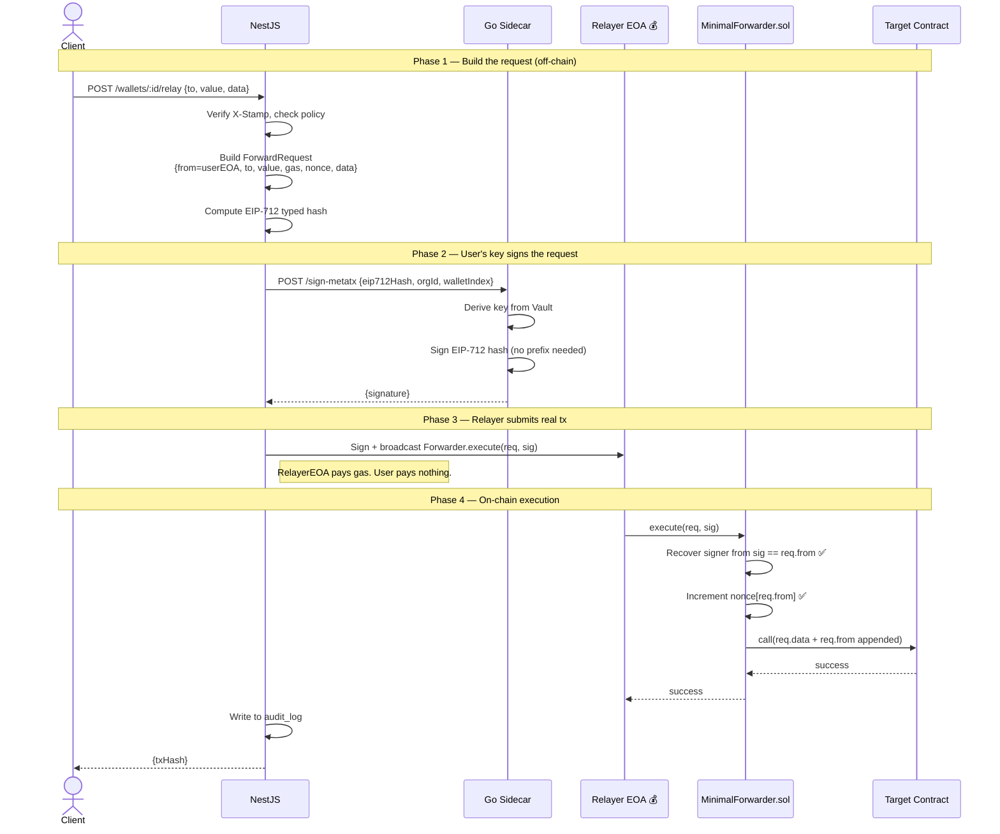

# Gas Relayer / Meta-Transaction Integration — WalletMVP

> **Why this over ERC-4337 for WalletMVP?**
> Your wallets are already EOAs managed by Vault + Go. Meta-transactions give you
> gasless UX without migrating wallets, deploying per-user contracts, or depending
> on a third-party bundler. One new contract, one new NestJS service, done.

---

## What you are building

```
TODAY
─────────────────────────────────────────────────────────────
  Go sidecar signs raw tx → NestJS broadcasts eth_sendRawTransaction
  User wallet = EOA (key in Vault)
  Gas = user must hold ETH ← problem

AFTER THIS INTEGRATION
─────────────────────────────────────────────────────────────
  Go sidecar signs EIP-712 message → NestJS submits via RelayerEOA
  User wallet = same EOA as before (no change)
  Gas = your RelayerEOA pays ← solved
```

---

## Architecture: What you deploy vs what already exists

```
WHAT YOU DEPLOY (one-time, one contract for whole platform)
┌──────────────────────────────────────────────────────────┐
│  MinimalForwarder.sol  (or use OpenZeppelin's)           │
│  • Verifies EIP-712 signature from user's EOA            │
│  • Checks + increments nonce (replay protection)         │
│  • Forwards the call to target contract                  │
│  • One contract serves ALL your users                    │
└──────────────────────────────────────────────────────────┘

WHAT YOU ADD TO NESTJS
┌───────────────────────┐  ┌───────────────────────────────┐
│  MetaTxBuilderService │  │  RelayerWalletService         │
│  builds ForwardRequest│  │  holds ETH, submits real txs  │
│  computes EIP-712 hash│  │  (ethers.Wallet from env var) │
└───────────────────────┘  └───────────────────────────────┘

WHAT YOU ADD TO GO SIDECAR
┌──────────────────────────────────────────────────────────┐
│  POST /sign-metatx endpoint                              │
│  Signs EIP-712 hash with user's Vault-derived key        │
│  Same key derivation as today, different hash format     │
└──────────────────────────────────────────────────────────┘

WHAT ALREADY EXISTS (no changes needed)
┌───────────────────────┐  ┌───────────────────────────────┐
│  Your EOA wallets     │  │  Your existing Go signing     │
│  (Vault + BIP32)      │  │  (just add one new endpoint)  │
│  unchanged            │  │                               │
└───────────────────────┘  └───────────────────────────────┘
```

---

## Architecture data flow

```
┌──────────────┐
│  Client App  │  POST /wallets/:id/relay  (stamped request)
└──────┬───────┘
       │
┌──────▼────────────────────────────────────────────────────┐
│  NestJS API (apps/api)                                    │
│  1. Verify X-Stamp header (StampVerifier)                 │
│  2. Check signing policy (PolicyEngine)                   │
│  3. MetaTxBuilderService: build ForwardRequest struct     │
│  4. Compute EIP-712 typed data hash                       │
│  5. POST /sign-metatx to Go sidecar                       │
│  6. RelayerWalletService: submit real tx with signature   │
│  7. Write to audit_log                                    │
└──────────────────────────────────────────────────────────┘
       │                      │
       │ /sign-metatx         │ eth_sendRawTransaction
       ▼                      ▼
┌─────────────────┐   ┌──────────────────────────────────┐
│  Go Sidecar     │   │  Ethereum / L2                   │
│  • Derive key   │   │                                  │
│    from Vault   │   │  MinimalForwarder.sol             │
│  • Sign EIP-712 │   │  ├─ verify EIP-712 sig           │
│    hash         │   │  ├─ check nonce                  │
│  • Return sig   │   │  └─ forward call to target       │
└─────────────────┘   └──────────────────────────────────┘
```

---

## Sequence diagram — your exact components



---

## Step-by-step: Exactly what you implement

### Step 1 — Deploy `MinimalForwarder.sol`

**One contract, one-time deploy, serves all users forever.**

You can use OpenZeppelin's battle-tested version directly:

```solidity
// SPDX-License-Identifier: MIT
pragma solidity ^0.8.23;

import "@openzeppelin/contracts/metatx/MinimalForwarder.sol";

// That's it — deploy this. OZ's MinimalForwarder implements
// EIP-712 verification and nonce management out of the box.
contract WalletMVPForwarder is MinimalForwarder {}
```

OpenZeppelin's `MinimalForwarder` already handles:
- EIP-712 domain separator with your contract address + chainId
- `ForwardRequest` struct verification
- Per-sender nonce tracking (replay protection)
- Forwarding the call with user's address appended

Deploy it, save the address as `FORWARDER_CONTRACT_ADDRESS` in your `.env`.

---

### Step 2 — Add `/sign-metatx` to your Go sidecar

Add to `cmd/crypto/handlers/sign_metatx.go`:

```go
// cmd/crypto/handlers/sign_metatx.go

package handlers

import (
    "encoding/json"
    "net/http"

    "github.com/ethereum/go-ethereum/accounts"
    "github.com/ethereum/go-ethereum/common/hexutil"
    "github.com/ethereum/go-ethereum/crypto"
)

type SignMetaTxRequest struct {
    // The EIP-712 typed data hash — computed by NestJS
    // This is: keccak256 of the full EIP-712 encoded ForwardRequest
    EIP712Hash  string `json:"eip712Hash"`
    OrgID       string `json:"orgId"`
    WalletIndex uint32 `json:"walletIndex"`
}

type SignMetaTxResponse struct {
    Signature string `json:"signature"` // 65-byte hex
}

func (h *Handler) SignMetaTx(w http.ResponseWriter, r *http.Request) {
    var req SignMetaTxRequest
    if err := json.NewDecoder(r.Body).Decode(&req); err != nil {
        http.Error(w, "bad request", 400)
        return
    }

    // Decode the EIP-712 hash from NestJS
    hashBytes, err := hexutil.Decode(req.EIP712Hash)
    if err != nil {
        http.Error(w, "invalid hash", 400)
        return
    }

    // Derive the user's private key from Vault (same as your existing flow)
    privKey, err := h.vault.DeriveKey(req.OrgID, req.WalletIndex)
    if err != nil {
        http.Error(w, "vault error", 500)
        return
    }

    // EIP-712 hashes are signed directly — no extra prefix
    // (the prefix is already baked into the EIP-712 encoding: \x19\x01)
    sig, err := crypto.Sign(hashBytes, privKey)
    if err != nil {
        http.Error(w, "sign error", 500)
        return
    }

    // Adjust v for Solidity ecrecover (v = 27 or 28, not 0 or 1)
    sig[64] += 27

    json.NewEncoder(w).Encode(SignMetaTxResponse{
        Signature: hexutil.Encode(sig),
    })
}
```

Register the route in your Go HTTP server (same place as your existing `/sign-tx`):

```go
// cmd/crypto/main.go — add alongside existing routes
mux.HandleFunc("/sign-metatx", handler.SignMetaTx)
```

---

### Step 3 — Add `MetaTxBuilderService` to NestJS

Create `libs/meta-tx/src/meta-tx-builder.service.ts`:

```typescript
// libs/meta-tx/src/meta-tx-builder.service.ts
// Builds the ForwardRequest struct and computes the EIP-712 hash

import { Injectable } from '@nestjs/common';
import { ethers } from 'ethers';

// Must match OpenZeppelin's MinimalForwarder exactly
const FORWARD_REQUEST_TYPE = [
  { name: 'from',  type: 'address' },
  { name: 'to',    type: 'address' },
  { name: 'value', type: 'uint256' },
  { name: 'gas',   type: 'uint256' },
  { name: 'nonce', type: 'uint256' },
  { name: 'data',  type: 'bytes'   },
];

export interface ForwardRequest {
  from:  string;  // user's EOA address
  to:    string;  // target contract
  value: bigint;  // ETH value (usually 0)
  gas:   bigint;  // gas limit for the forwarded call
  nonce: bigint;  // user's nonce from the Forwarder contract
  data:  string;  // encoded function call
}

@Injectable()
export class MetaTxBuilderService {
  private readonly provider: ethers.JsonRpcProvider;
  private readonly forwarder: ethers.Contract;
  private readonly domain: ethers.TypedDataDomain;

  constructor() {
    this.provider = new ethers.JsonRpcProvider(process.env.RPC_URL);

    // Read nonces from the deployed Forwarder
    this.forwarder = new ethers.Contract(
      process.env.FORWARDER_CONTRACT_ADDRESS!,
      ['function getNonce(address from) view returns (uint256)'],
      this.provider,
    );

    // EIP-712 domain — must match what Forwarder was deployed with
    // OZ MinimalForwarder uses name="MinimalForwarder", version="0.0.1"
    this.domain = {
      name: 'MinimalForwarder',
      version: '0.0.1',
      chainId: parseInt(process.env.CHAIN_ID!),
      verifyingContract: process.env.FORWARDER_CONTRACT_ADDRESS!,
    };
  }

  // Build the request — call this per user action
  async buildRequest(params: {
    userAddress: string;
    to: string;
    value: bigint;
    data: string;
    gasLimit?: bigint;
  }): Promise<ForwardRequest> {
    const nonce = await this.forwarder.getNonce(params.userAddress);

    return {
      from:  params.userAddress,
      to:    params.to,
      value: params.value,
      gas:   params.gasLimit ?? 200_000n,
      nonce,
      data:  params.data,
    };
  }

  // Compute the EIP-712 hash — this is what Go sidecar signs
  computeEIP712Hash(request: ForwardRequest): string {
    return ethers.TypedDataEncoder.hash(
      this.domain,
      { ForwardRequest: FORWARD_REQUEST_TYPE },
      request,
    );
  }

  // Encode the Forwarder.execute() call — used by RelayerWalletService
  encodeExecute(request: ForwardRequest, signature: string): string {
    const iface = new ethers.Interface([
      'function execute(tuple(address from, address to, uint256 value, uint256 gas, uint256 nonce, bytes data) req, bytes signature) returns (bool, bytes)',
    ]);
    return iface.encodeFunctionData('execute', [request, signature]);
  }
}
```

---

### Step 4 — Add `RelayerWalletService` to NestJS

Create `libs/meta-tx/src/relayer-wallet.service.ts`:

```typescript
// libs/meta-tx/src/relayer-wallet.service.ts
// This is YOUR backend wallet that pays gas.
// It's a regular ethers.Wallet funded with ETH.
// Keep its private key in env — it does NOT need Vault.

import { Injectable, OnModuleInit } from '@nestjs/common';
import { ethers } from 'ethers';

@Injectable()
export class RelayerWalletService implements OnModuleInit {
  private wallet: ethers.Wallet;
  private provider: ethers.JsonRpcProvider;

  onModuleInit() {
    this.provider = new ethers.JsonRpcProvider(process.env.RPC_URL);
    // RELAYER_PRIVATE_KEY is YOUR platform key — not a user key
    // Fund this address with ETH to pay for gas
    this.wallet = new ethers.Wallet(
      process.env.RELAYER_PRIVATE_KEY!,
      this.provider,
    );
  }

  // Submit the real Ethereum transaction
  async relay(params: {
    to: string;       // Forwarder contract address
    data: string;     // encoded execute(req, sig) call
    gasLimit?: bigint;
  }): Promise<{ txHash: string }> {
    // Check relayer has enough ETH to cover gas
    const balance = await this.provider.getBalance(this.wallet.address);
    if (balance < ethers.parseEther('0.01')) {
      throw new Error('Relayer ETH balance too low — top up RELAYER_ADDRESS');
    }

    const tx = await this.wallet.sendTransaction({
      to: params.to,
      data: params.data,
      gasLimit: params.gasLimit ?? 300_000n,
    });

    // Wait for confirmation
    const receipt = await tx.wait(1);
    return { txHash: receipt!.hash };
  }

  get relayerAddress(): string {
    return this.wallet.address;
  }
}
```

---

### Step 5 — Add `MetaTxService` to NestJS (orchestrator)

Create `libs/meta-tx/src/meta-tx.service.ts`:

```typescript
// libs/meta-tx/src/meta-tx.service.ts
// Orchestrates the full meta-tx flow: build → sign → relay

import { Injectable } from '@nestjs/common';
import { MetaTxBuilderService } from './meta-tx-builder.service';
import { RelayerWalletService } from './relayer-wallet.service';
import { CryptoClientService } from '@app/crypto-client'; // your existing lib

@Injectable()
export class MetaTxService {
  constructor(
    private readonly builder: MetaTxBuilderService,
    private readonly relayer: RelayerWalletService,
    private readonly cryptoClient: CryptoClientService,
  ) {}

  async send(params: {
    orgId: string;
    walletIndex: number;
    userAddress: string;
    to: string;
    value: bigint;
    data: string;
  }): Promise<{ txHash: string }> {

    // 1. Build the ForwardRequest
    const request = await this.builder.buildRequest({
      userAddress: params.userAddress,
      to: params.to,
      value: params.value,
      data: params.data,
    });

    // 2. Compute EIP-712 hash
    const eip712Hash = this.builder.computeEIP712Hash(request);

    // 3. Send to Go sidecar to sign with user's Vault-derived key
    const { signature } = await this.cryptoClient.signMetaTx({
      eip712Hash,
      orgId: params.orgId,
      walletIndex: params.walletIndex,
    });

    // 4. Encode the Forwarder.execute() call
    const calldata = this.builder.encodeExecute(request, signature);

    // 5. Relay it — your backend pays the gas
    const { txHash } = await this.relayer.relay({
      to: process.env.FORWARDER_CONTRACT_ADDRESS!,
      data: calldata,
    });

    return { txHash };
  }
}
```

---

### Step 6 — Add `signMetaTx` to your existing `CryptoClientService`

In `libs/crypto-client/src/crypto-client.service.ts`, add one method:

```typescript
// Add to your existing CryptoClientService

async signMetaTx(params: {
  eip712Hash: string;
  orgId: string;
  walletIndex: number;
}): Promise<{ signature: string }> {
  const response = await fetch(`${this.cryptoServiceUrl}/sign-metatx`, {
    method: 'POST',
    headers: { 'Content-Type': 'application/json' },
    body: JSON.stringify({
      eip712Hash: params.eip712Hash,
      orgId: params.orgId,
      walletIndex: params.walletIndex,
    }),
  });
  if (!response.ok) throw new Error('Go sidecar sign-metatx failed');
  return response.json(); // { signature: "0x..." }
}
```

---

### Step 7 — Add the relay endpoint to your NestJS controller

In `apps/api/src/wallets/wallets.controller.ts`:

```typescript
// Add this endpoint alongside your existing /send

@Post(':id/relay')
async relay(
  @Param('id') walletId: string,
  @Body() dto: RelayDto,              // { to, value, data }
  @Headers('x-stamp') stamp: string,
) {
  // 1. Verify stamp (existing StampVerifier)
  await this.stampVerifier.verify(stamp, dto);

  // 2. Load wallet from DB
  const wallet = await this.walletService.findById(walletId);

  // 3. Encode the calldata for the target contract
  // (same as you do today for raw tx signing)
  const calldata = dto.data; // already ABI-encoded from client

  // 4. Relay via meta-tx
  const { txHash } = await this.metaTxService.send({
    orgId: wallet.orgId,
    walletIndex: wallet.derivationIndex,
    userAddress: wallet.address,
    to: dto.to,
    value: BigInt(dto.value ?? 0),
    data: calldata,
  });

  // 5. Audit log (existing)
  await this.auditLogService.write({
    orgId: wallet.orgId,
    walletId,
    action: 'RELAY_META_TX',
    metadata: { txHash, to: dto.to },
  });

  return { txHash };
}
```

---

## New environment variables

```bash
# .env additions
FORWARDER_CONTRACT_ADDRESS=0x...   # your deployed MinimalForwarder
RELAYER_PRIVATE_KEY=0x...          # your platform EOA that pays gas
RELAYER_ADDRESS=0x...              # derived from above — fund this with ETH
CHAIN_ID=8453                      # Base mainnet recommended
```

---

## Fund the Relayer

The relayer is just a normal EOA you control. Fund it from your deployment wallet:

```bash
# Send ETH to your relayer address to cover gas
# On Base: 0.1 ETH covers ~1000 meta-txs at normal gas prices
cast send $RELAYER_ADDRESS --value 0.1ether --private-key $DEPLOYER_KEY
```

Set up monitoring to alert when relayer balance drops below a threshold:

```typescript
// libs/meta-tx/src/relayer-monitor.service.ts
// Run on a cron or before every relay call

async checkBalance(): Promise<void> {
  const balance = await this.provider.getBalance(this.relayer.relayerAddress);
  if (balance < ethers.parseEther('0.05')) {
    // Alert via your existing monitoring — Slack, PagerDuty, email
    this.logger.error(`Relayer balance low: ${ethers.formatEther(balance)} ETH`);
  }
}
```

---

## New module to create

Create `libs/meta-tx/` following your existing NestJS monorepo pattern:

```
libs/
  meta-tx/
    src/
      meta-tx.module.ts        ← NestJS module
      meta-tx.service.ts       ← orchestrator (Step 5)
      meta-tx-builder.service.ts ← EIP-712 builder (Step 3)
      relayer-wallet.service.ts  ← submits txs (Step 4)
      relayer-monitor.service.ts ← balance alerts
    index.ts
```

---

## What you do NOT need to change

```
✅ Your existing EOA wallets      — unchanged
✅ Your Vault setup               — unchanged
✅ Your BIP32 derivation          — unchanged
✅ Your existing /sign-tx flow    — unchanged, still works for users with ETH
✅ Your PostgreSQL schema          — no new columns needed
✅ Your stamp authentication       — unchanged, relay endpoint uses same guard
✅ Your audit log                  — just add a new action type 'RELAY_META_TX'
```

---

## Important limitation: target contract must support ERC-2771

The target contract (e.g. your ERC-20 token, your own contracts) must read
`_msgSender()` instead of `msg.sender` to get the user's address — because
`msg.sender` will be the Forwarder, not the user.

```
Contract supports ERC-2771?     → Meta-tx works perfectly ✅
Contract uses raw msg.sender?   → msg.sender = Forwarder, not user ⚠️
```

**Practical impact for WalletMVP:**

| Target | ERC-2771 support? | Works? |
|---|---|---|
| Your own contracts | You add it | ✅ Yes |
| OpenZeppelin ERC-20 (standard) | No | ⚠️ msg.sender = Forwarder |
| OpenZeppelin ERC-20 with ERC2771Context | Yes | ✅ Yes |
| USDC (Circle) | No | ⚠️ |
| Uniswap | No | ⚠️ Use ERC-4337 instead |
| Your WalletMVP contracts | You control them | ✅ Add ERC2771Context |

For contracts you do not control that lack ERC-2771, use ERC-4337 instead,
or have the relayer call them directly using the user's EOA (which already
works since your Go sidecar owns the key — just the existing flow).

---

## Deployment order

```
1. Deploy WalletMVPForwarder.sol         (one-time)
   → save address as FORWARDER_CONTRACT_ADDRESS

2. Generate a new EOA for the relayer
   → cast wallet new
   → save private key as RELAYER_PRIVATE_KEY
   → fund it with ETH (0.1 ETH on Base to start)

3. Add /sign-metatx handler to Go sidecar
   → redeploy Go Docker container

4. Create libs/meta-tx/ in NestJS
   → add MetaTxModule to AppModule imports

5. Add POST /wallets/:id/relay endpoint

6. Test end-to-end on testnet (Base Sepolia)
   → send a meta-tx, confirm gas came from RELAYER_ADDRESS not user wallet

7. Monitor relayer balance — top up when low
```

---

## Cost on Base (recommended chain)

| Action | Gas | Approx cost |
|---|---|---|
| Deploy MinimalForwarder (one-time) | ~500k gas | ~$0.10 |
| Each meta-tx relay | ~50k–80k gas overhead | ~$0.001–0.01 |
| Fund relayer 0.1 ETH | — | covers ~5,000–10,000 relays |

**On Base, this is nearly free.** On Ethereum mainnet the overhead is still
much cheaper than ERC-4337 (~3–5× less gas per tx).

---

## Further reading

- [OpenZeppelin MinimalForwarder](https://github.com/OpenZeppelin/openzeppelin-contracts/blob/master/contracts/metatx/MinimalForwarder.sol) — the contract you deploy
- [EIP-2771: Secure Protocol for Native Meta Transactions](https://eips.ethereum.org/EIPS/eip-2771) — the standard your target contracts should implement
- [EIP-712: Typed Structured Data Signing](https://eips.ethereum.org/EIPS/eip-712) — the signing scheme used for ForwardRequest
