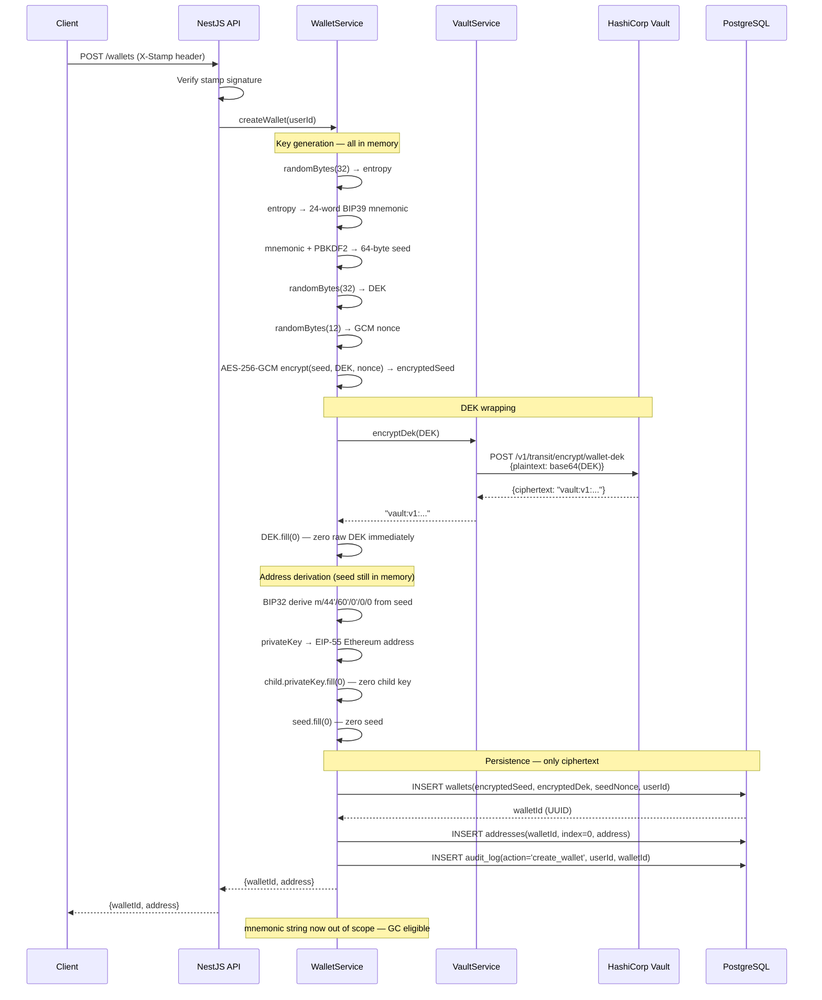
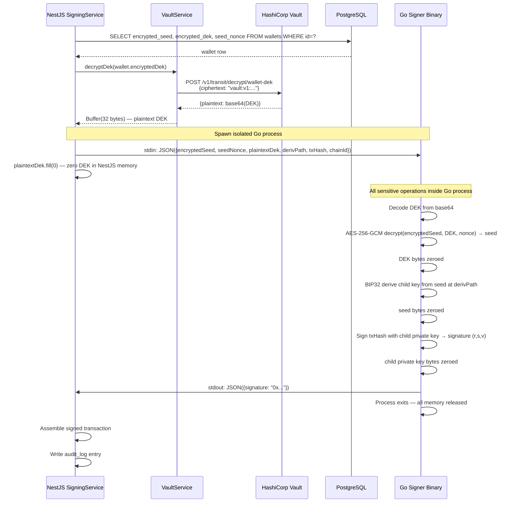

# Phase 2 — Key Management Deep-Dive

This document covers every cryptographic decision in the wallet creation and
key storage pipeline. It explains what each component does, why it was chosen
over alternatives, and what the security guarantees are.

---

## Overview: the full key hierarchy

WalletMVP uses a three-layer key hierarchy. Understanding this hierarchy is
the foundation for understanding every other decision in this phase.

```
Layer 0: Vault KEK (Key Encryption Key)
│
│  Lives inside HashiCorp Vault Transit engine.
│  Never leaves Vault. Never touches your application.
│  Protects: the DEK.
│
└──► Layer 1: DEK (Data Encryption Key)
     │
     │  32 random bytes. One per wallet.
     │  Exists briefly in application memory during creation and signing.
     │  Stored encrypted (by KEK) in Postgres as "vault:v1:..." ciphertext.
     │  Protects: the wallet seed.
     │
     └──► Layer 2: BIP39 seed (256-bit entropy mnemonic)
          │
          │  64-byte seed derived from a 24-word mnemonic phrase.
          │  Exists briefly in Go signer memory during signing only.
          │  Stored encrypted (by DEK) in Postgres as AES-256-GCM ciphertext.
          │  Protects: all child private keys.
          │
          └──► Derived child private keys (never stored)
               │
               │  Derived on demand via BIP32 at signing time.
               │  Exist only in Go signer memory, zeroed immediately after use.
               │
               └──► Ethereum addresses (public, stored in plaintext)
```

**The rule:** anything below the dashed line in Postgres is ciphertext.
The only plaintext data in the database is wallet addresses, which are
public information anyway.

---

## BIP39: mnemonic and seed generation

### What BIP39 is

BIP39 is the standard for generating a human-readable mnemonic phrase
(12 or 24 words) from random entropy, and then converting that phrase into
a binary seed that can be used to initialise an HD wallet.

The process has two stages:

**Stage 1 — Entropy to mnemonic:**

1. Generate N bits of random entropy (128 bits for 12 words, 256 bits for 24 words)
2. Compute SHA256 of the entropy; take the first N/32 bits as a checksum
3. Concatenate entropy + checksum → split into 11-bit groups
4. Map each 11-bit group to a word in the BIP39 wordlist (2048 words)
5. Result: the mnemonic phrase

**Stage 2 — Mnemonic to seed:**

1. Apply PBKDF2-HMAC-SHA512 with:
   - Password: the mnemonic phrase (UTF-8 normalised)
   - Salt: `"mnemonic" + optional_passphrase`
   - Iterations: 2048
   - Output length: 64 bytes
2. Result: the 64-byte binary seed

### Why 24 words (256-bit), not 12 words (128-bit)

128 bits of entropy is already computationally infeasible to brute-force with
current hardware. However, 256 bits provides a meaningful margin against
future advances, costs nothing extra in complexity, and is the standard choice
for custodial services where you are responsible for other people's funds.

### Why `@scure/bip39`

The `@scure` namespace by paulmillr is formally audited, has minimal
dependencies, and uses the platform CSPRNG directly. The library was
initially developed for js-ethereum-cryptography and later extracted.
Commits are signed with PGP keys. This is the correct choice over bundling
ethers.js or web3.js just for mnemonic generation.

### What NOT to do with the mnemonic

- Do not return it to the API caller. The caller gets a wallet ID and an
  Ethereum address. If they want the mnemonic, that is a separate export
  flow that requires explicit user consent and its own secure channel.
- Do not log it. Add a lint rule or custom ESLint plugin that flags any
  `console.log` or logger call containing the word `mnemonic` or `seed`.
- Do not store it in any variable that persists beyond the `createWallet`
  function scope.

---

## AES-256-GCM: encrypting the seed

### Why AES-256-GCM

AES-256-GCM is an authenticated encryption scheme. "Authenticated" means it
provides both confidentiality and integrity — not only is the ciphertext
unintelligible without the key, but any tampering with the ciphertext is
detected at decryption time (the GCM authentication tag verification fails).

This matters for a wallet backend: if an attacker with DB access modified the
ciphertext, without authentication you might decrypt it to garbage and sign
garbage transactions. With GCM authentication, decryption fails loudly with
an authentication error, preventing silent corruption.

### Parameters

**Key:** The 32-byte DEK. Must be random, must be unique per wallet. Use
`crypto.randomBytes(32)` — do not derive the DEK from a password or another key.

**Nonce (IV):** 12 bytes, randomly generated fresh for every encryption.
This is critical: if you ever use the same nonce with the same key twice,
GCM's security collapses entirely. 12 bytes of random nonce with a fresh key
per wallet means collision probability is negligible.

**Authentication tag:** GCM appends a 16-byte authentication tag to the
ciphertext. You must store and verify it. Node's `cipher.getAuthTag()` gives
you these 16 bytes after `cipher.final()`.

### What to store in Postgres

The `encrypted_seed` column should store a single base64-encoded blob
containing: `nonce (12 bytes) || ciphertext (64 bytes) || auth_tag (16 bytes)`
= 92 bytes total, or 124 characters as base64.

Keeping these together simplifies decryption: you always have everything you
need in one field. Storing them separately creates more surface area for
mismatches or partial writes.

### Memory lifecycle

The following explains exactly how long the seed exists in plaintext and what
zeroes it:

```
createWallet():
  mnemonic = generateMnemonic()    ← plaintext mnemonic, string in heap
  seed = mnemonicToSeed(mnemonic)  ← 64-byte Buffer
  dek = randomBytes(32)            ← 32-byte Buffer
  encryptedSeed = encrypt(seed, dek)
  encryptedDek = await vault.encryptDek(dek)
  dek.fill(0)                      ← DEK zeroed ✓
  address = deriveAddress(seed)    ← seed used here
  seed.fill(0)                     ← seed zeroed ✓
  return { walletId, address }
  ← mnemonic string is now unreferenced, eligible for GC
    (cannot be zeroed — JS strings are immutable)
```

The mnemonic string cannot be explicitly zeroed because JavaScript strings
are immutable. This is a known limitation of doing cryptography in a
garbage-collected language. Mitigation: the mnemonic exists for the shortest
possible time (only during the `createWallet` call), and the converted seed
Buffer is explicitly zeroed.

---

## BIP32: hierarchical deterministic key derivation

### What BIP32 does

BIP32 specifies how to take a 64-byte seed and produce a tree of deterministic
child key pairs. The tree is defined by a derivation path. Starting from the
root key (derived from the seed), you derive child keys by index.

**Hardened vs. non-hardened derivation:**

- Indices 0–2³¹−1: non-hardened. Child public keys can be derived from the
  parent extended public key alone. This is a privacy/security risk if the
  parent xpub is leaked.
- Indices 2³¹ and above (written with `'`): hardened. Child public keys can
  only be derived if you have the parent private key. Much safer.

In the BIP44 path `m/44'/60'/0'/0/N`:

- `44'`: BIP44 purpose (hardened)
- `60'`: Ethereum coin type (hardened)
- `0'`: account index (hardened)
- `0`: external chain (non-hardened — this is the public-facing address chain)
- `N`: address index (non-hardened)

The first three levels are hardened, which means the extended public key at
the `m/44'/60'/0'/0` level cannot be used to reveal the root seed.

### Why child keys are never stored

Storing child private keys would mean you have more secrets to protect.
Instead, you store only the encrypted seed. At signing time, you decrypt the
seed and derive the child key in memory. The derivation is deterministic and
fast (microseconds), so there is no performance reason to cache child keys.

This design means your entire key hierarchy for a wallet is protected by one
encrypted blob. Rotating your encryption (re-encrypting the seed with a new
DEK) protects all past and future child keys for that wallet simultaneously.

### Library: `@scure/bip32`

Formally audited, minimal, uses the same noble cryptography primitives as the
rest of the scure ecosystem. The `chainCode` property of the HDKey object is
essentially a private part of the secret master key — it must be guarded with
the same care as the private key itself. The Go signing binary uses
`tyler-smith/go-bip32` for the equivalent operation.

---

## Per-wallet DEK: why this matters

### The argument for a single global DEK

One DEK for all wallets would be simpler. One Vault entry, one encryption key
in memory. You might be tempted by this for an MVP.

### Why per-wallet DEK is non-negotiable

Consider what happens when a DEK is compromised:

- **Single global DEK:** Every encrypted seed in your database is immediately
  decryptable. One breach exposes every user's wallet.
- **Per-wallet DEK:** Only the wallets whose DEKs were obtained are exposed.
  If you rotate the compromised DEK and re-encrypt that wallet's seed, the
  damage is contained.

The cost is trivial: one extra row per wallet in Vault's keyring metadata and
one extra column in your wallets table. The blast radius reduction is enormous.
This is the same reasoning Turnkey uses for per-organisation key material.

### DEK naming in Vault

All wallet DEKs are encrypted under the same Transit key ring (`wallet-dek`).
The DEK itself is the random bytes; Vault's key ring wraps it. You do not
create one Transit key per wallet — you have one Transit key ring and encrypt
many different DEKs under it.

The distinction:

- Transit key ring (`wallet-dek`): the KEK. One key, managed by Vault, versioned.
- DEK: 32 random bytes generated by your app, encrypted BY the key ring.
  One per wallet. Stored as ciphertext in Postgres.

---

## Address derivation and the `addresses` table

### What to cache

Ethereum addresses are public information — they are not sensitive. After
you derive an address for the first time (from the plaintext seed during wallet
creation), cache it in the `addresses` table alongside the derivation index.

Every subsequent lookup for "what is the address at index 3 for wallet X?"
reads from the cache without decrypting anything. This is both faster and
safer than decrypting the seed on every address lookup.

### EIP-55 checksum addresses

Always store and return addresses in EIP-55 format (mixed-case checksum
encoding). This is a checksum baked into the capitalisation of the hex string.
Viem's `privateKeyToAddress` returns EIP-55 format by default. Do not
lowercase or uppercase addresses when storing them.

---

One mnemonic per organization (your B2B customer), generated once when they onboard. Every wallet/address they ever need is derived from that single seed using BIP32 paths — m/44'/60'/0'/0/0, m/44'/60'/0'/0/1, m/44'/60'/0'/0/N — no new entropy needed, ever.

## Wallet creation: full sequence



---

## Decryption path: how the seed is recovered for signing

This sequence shows only the key management portion of signing. The full
signing sequence (including gas estimation and broadcast) is in TASKS.md.



---

## Security properties and their limits

| Property                         | Achieved | How                                    | Limit                                     |
| -------------------------------- | -------- | -------------------------------------- | ----------------------------------------- |
| Seed never in DB plaintext       | ✓        | AES-256-GCM encryption                 | Compromised DEK + DB = exposed            |
| DEK never in DB plaintext        | ✓        | Vault Transit wrapping                 | Compromised Vault = exposed               |
| KEK never in app memory          | ✓        | Vault handles it internally            | Compromised Vault host = exposed          |
| Private key never in API process | ✓        | Go binary isolation                    | Go process memory dump exposes it briefly |
| Key zeroed after use             | ✓        | Explicit Buffer.fill(0) / Go zero loop | GC may retain string data                 |
| Audit trail of all decryptions   | ✓        | Vault audit log + app audit_log        | Log files must be protected               |
| Per-wallet blast radius          | ✓        | One DEK per wallet                     | Compromising Vault exposes all DEKs       |
| Key rotation                     | ✓        | Vault key versioning + rewrap job      | Requires a background job to complete     |
