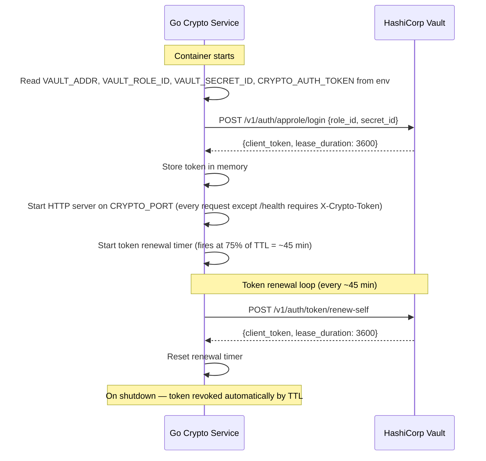
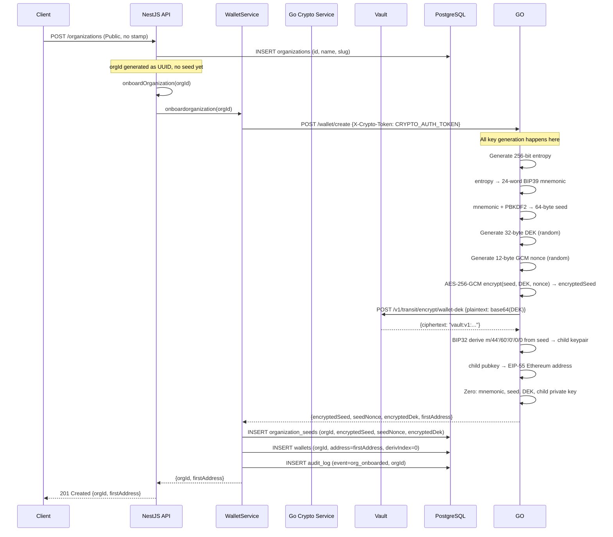
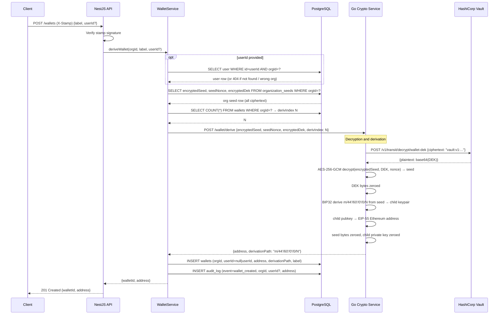
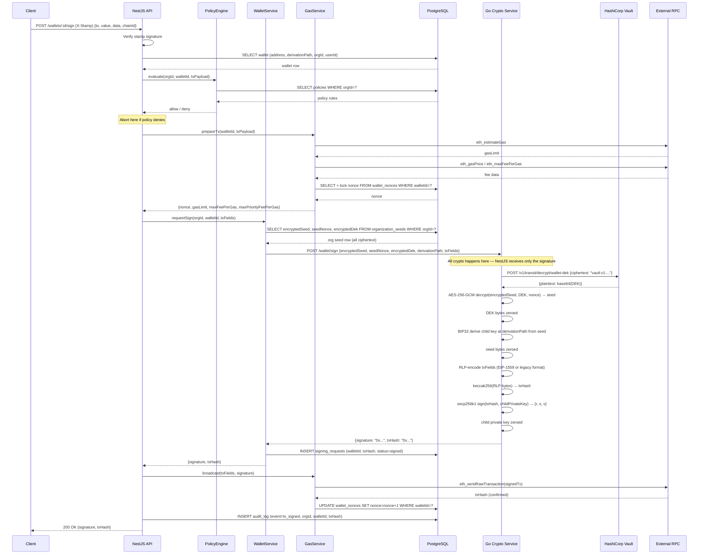

# WalletMVP — Sequence Diagrams

All diagrams reflect the current architecture:

- Go crypto service is a long-lived HTTP sidecar (not a spawned process)
- Go owns all cryptographic operations including Vault calls
- NestJS never holds a Vault token or any plaintext key material
- txHash is computed inside Go (RLP encode → keccak256), not in NestJS

---

## 1. Go Crypto Service startup — AppRole login and token renewal



---

## 2. organization creation & onboarding — create org, generate and store seed

Called once via `POST /organizations`. Creates the organization record,
generates the master BIP39 seed from which all their wallet addresses will
be derived, derives the first signing wallet, and returns a one-time
bootstrap token.



---

## 3. Child wallet derivation

Called when an organization needs a new wallet address. Derives the next
child key from the existing org seed without generating new entropy. `userId`
is optional — omit it for system wallets (treasury, deployer, etc.).



---

## 4. Transaction signing — full cycle



---

## 5. SecretID rotation (manual, every 30 days)

The Go crypto service does **not** self-rotate the SecretID. It is valid for
30 days (`secret_id_ttl=720h`) with unlimited uses; you rotate it manually
before the TTL expires (full procedure in `docs/VAULT_INIT.md`):

```bash
source .env
docker exec -e VAULT_TOKEN="$VAULT_ROOT_TOKEN" walletmvp-vault \
  vault write -f auth/approle/role/wallet-signer/secret-id
# then update VAULT_SECRET_ID in .env and restart the crypto container
```

> Historical note: an earlier design had the Go service generate a new
> single-use SecretID after every login (self-rotation on startup). That code
> path was removed — see `docs/VAULT.md` → "SecretID rotation".
