# WalletMVP — Sequence Diagrams

All diagrams reflect the current architecture:

- Go crypto service is a long-lived HTTP sidecar (not a spawned process)
- Go owns all cryptographic operations including Vault calls
- NestJS never holds a Vault token or any plaintext key material
- txHash is computed inside Go (RLP encode → keccak256), not in NestJS
- `POST /organizations` creates and onboards in one request — there is no separate onboard step
- Flat routes: `/api-keys`, `/policies`, `/users`, `/wallets` — not org-scoped prefixes

---

## 1. Go Crypto Service startup — AppRole login and token renewal

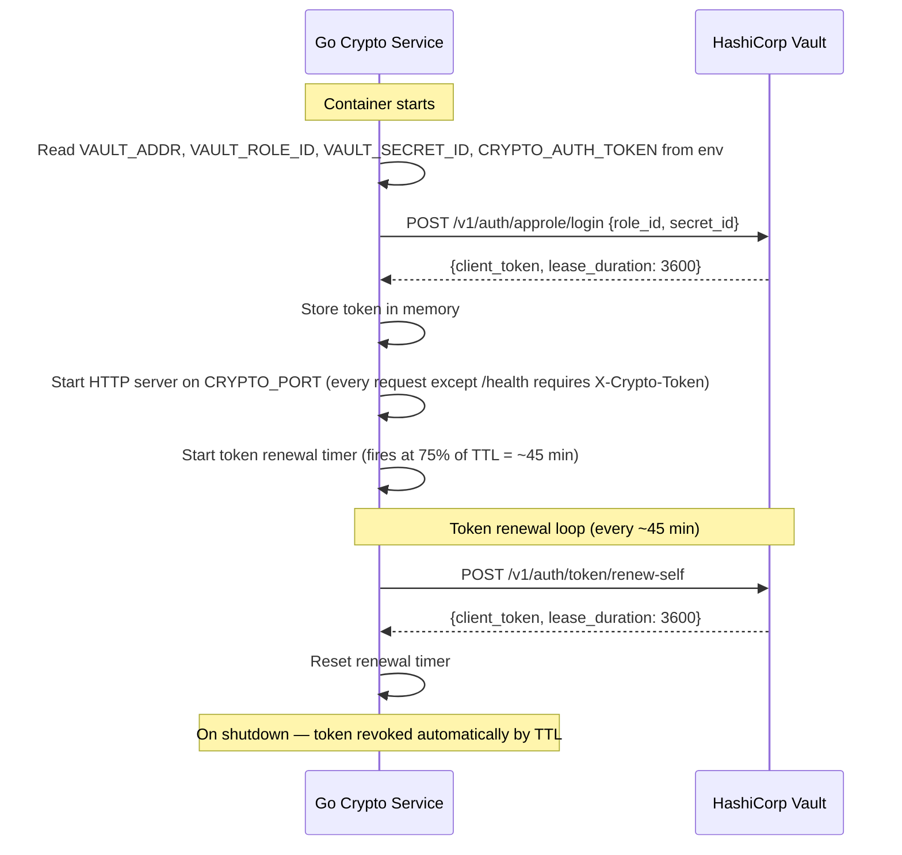

---

## 2. Organization creation — onboarding baked in

`POST /organizations` is public (no stamp). It creates the org record, generates
the BIP39 seed, stores all ciphertext, derives the first wallet, and returns a
one-time bootstrap token. There is no separate onboard endpoint.

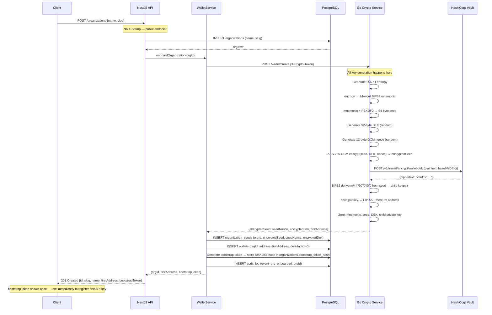

---

## 3. API key registration — bootstrap path (first key)

The first key for an org uses `X-Bootstrap-Token` instead of `X-Stamp`.
After registration the bootstrap token is cleared and can never be used again.

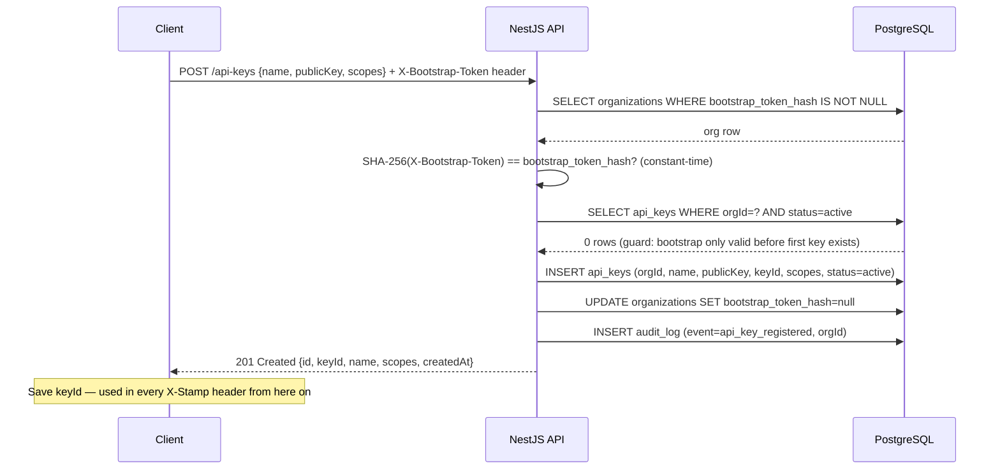

---

## 4. API key registration — stamp path (subsequent keys)

Subsequent keys require a valid stamp from an existing key with `key:write` scope.

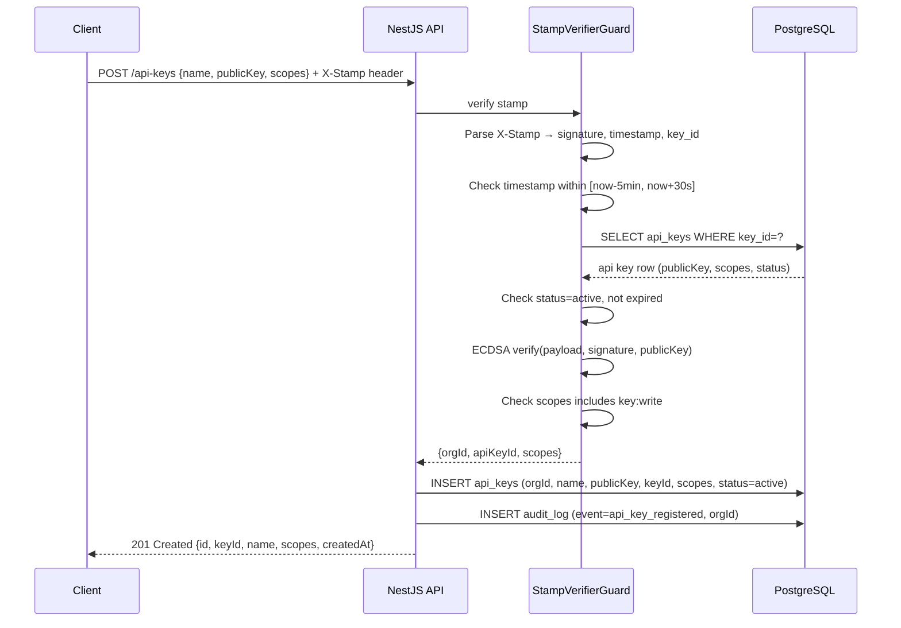

---

## 5. Child wallet derivation

Called when an org needs a new wallet address. Derives the next child key from
the existing seed without generating new entropy. `userId` is optional.

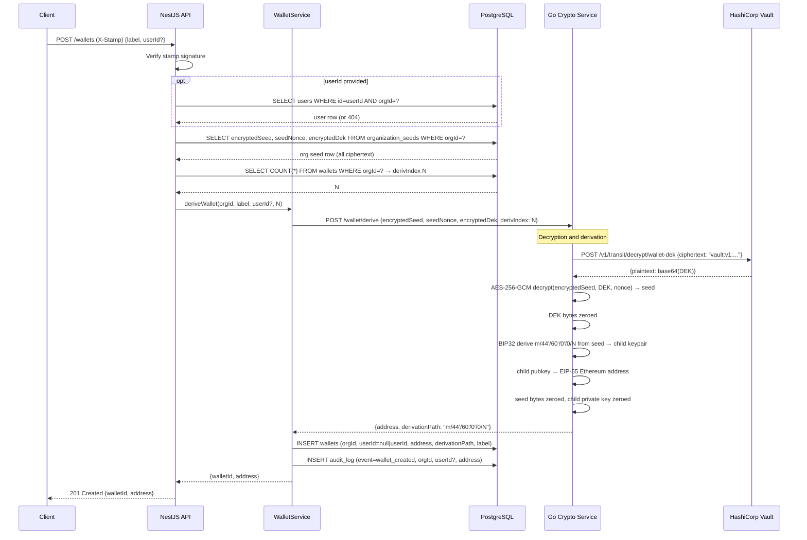

---

## 6. Transaction signing — full cycle

The endpoint is `POST /wallets/:id/sign-transaction`. The nonce is always
assigned server-side via atomic upsert. The response returns immediately after
broadcast; `status` reflects the broadcasted state, not confirmed.

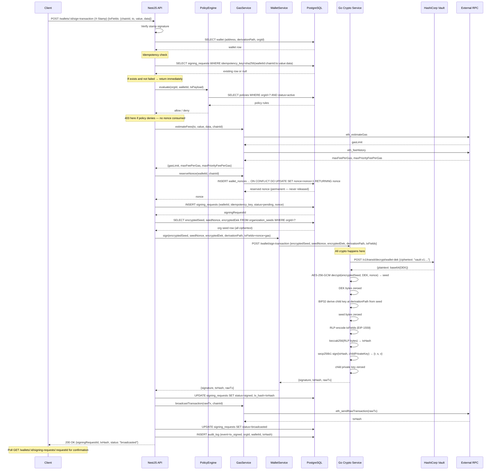

---

## 7. Signing request status poll

After receiving `status: "broadcasted"`, clients poll this endpoint to check
for confirmation, failure, or drop.

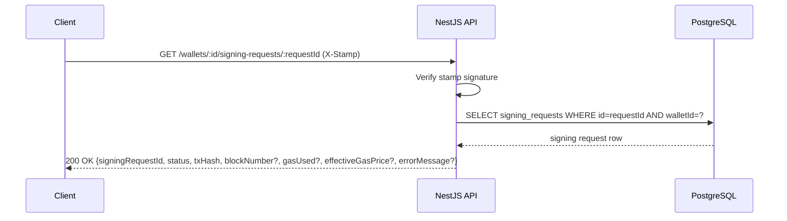

---

## 8. EIP-712 typed data signing

The EIP-712 hash is constructed in NestJS using viem's `hashTypedData`.
Go receives a raw 32-byte hash and signs it without interpreting the schema.

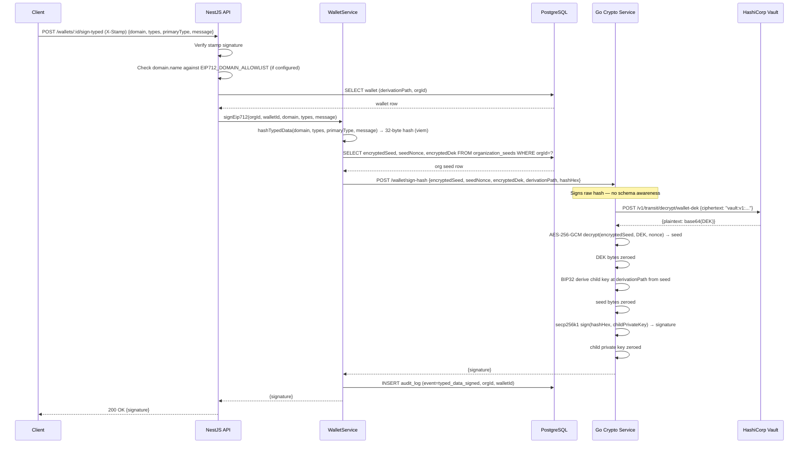

---

## 9. Personal message signing (EIP-191)

Same flow as typed signing. NestJS constructs the EIP-191 prefixed hash;
Go signs the raw 32 bytes.

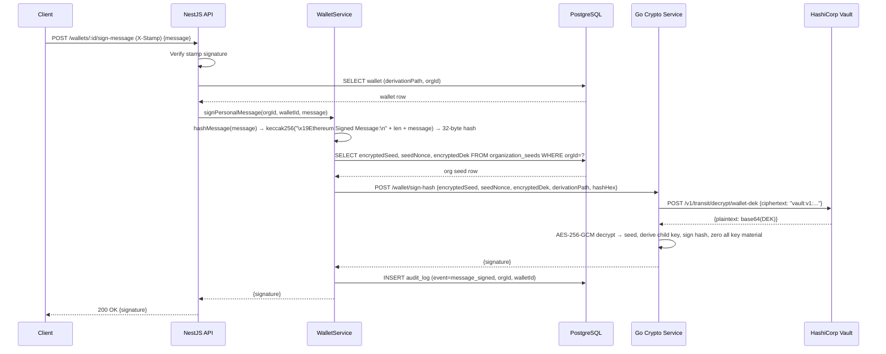

---

## 10. Policy creation

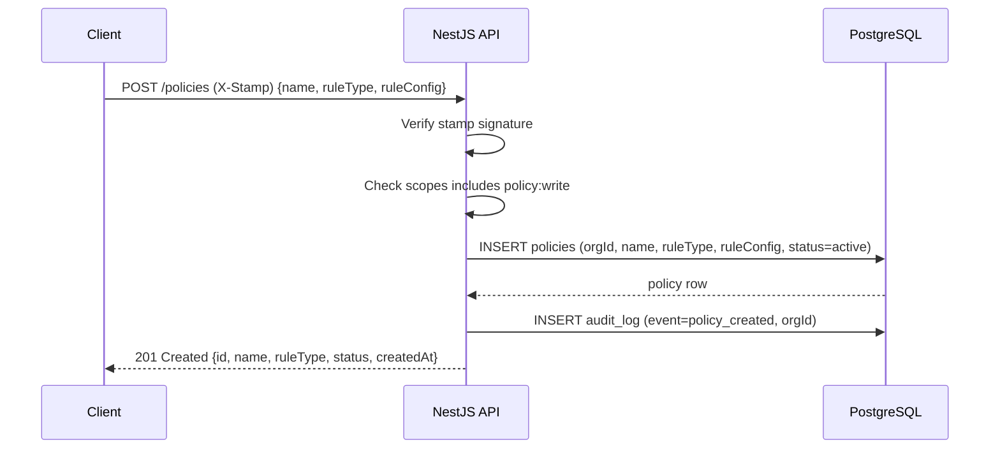

---

## 11. Audit log retrieval

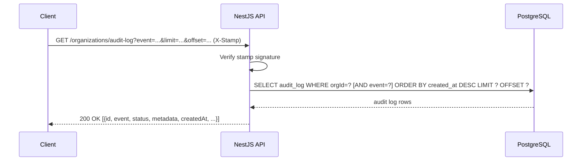

---

## 12. SecretID rotation (manual, every 30 days)

The Go crypto service does **not** self-rotate the SecretID. It is valid for
30 days (`secret_id_ttl=720h`) with unlimited uses; rotate it manually before
the TTL expires:

```bash
source .env.vault
docker exec -e VAULT_TOKEN="$VAULT_ROOT_TOKEN" walletmvp-vault \
  vault write -f auth/approle/role/wallet-signer/secret-id
# then update VAULT_SECRET_ID in .env and restart the crypto container
```

> Historical note: an earlier design had the Go service generate a new
> single-use SecretID after every login (self-rotation on startup). That code
> path was removed — see `docs/VAULT.md` → "SecretID rotation".
