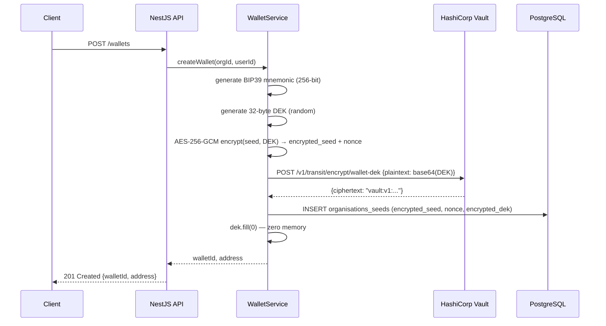
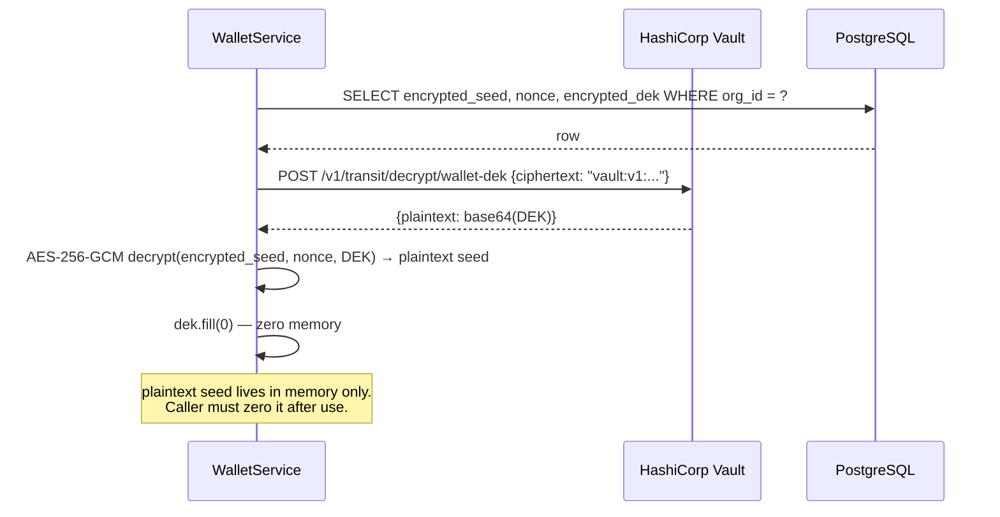
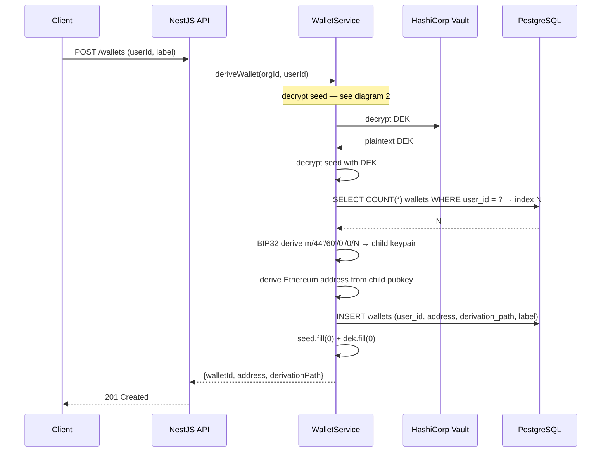
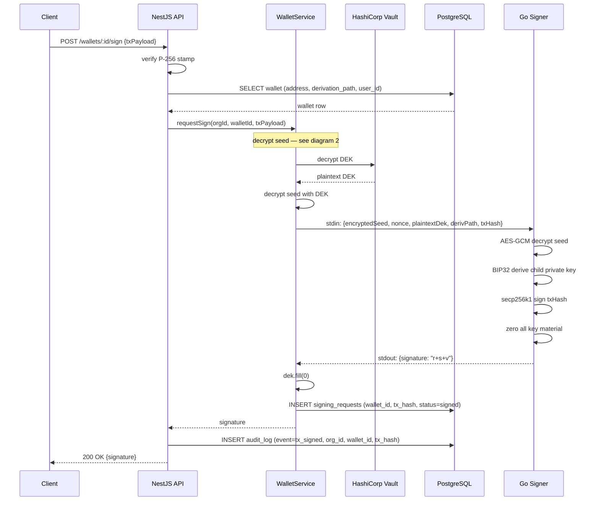

# WalletMVP — Sequence Diagrams

---

## 1. Generate wallet seed — encrypt & store

---

## 2. Decrypt seed (called internally before any signing)

---

## 3. Derive child wallet from seed

---

## 4. Sign transaction — full cycle

