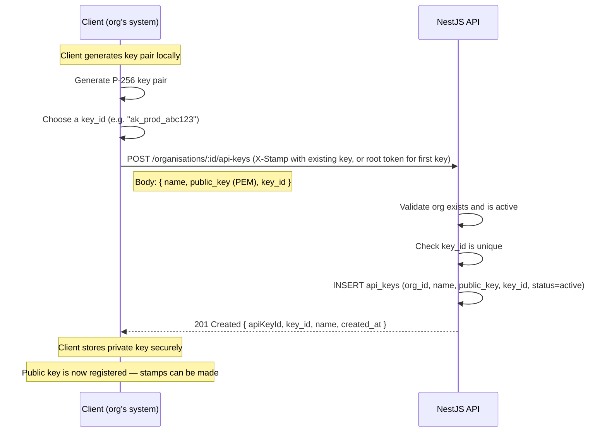
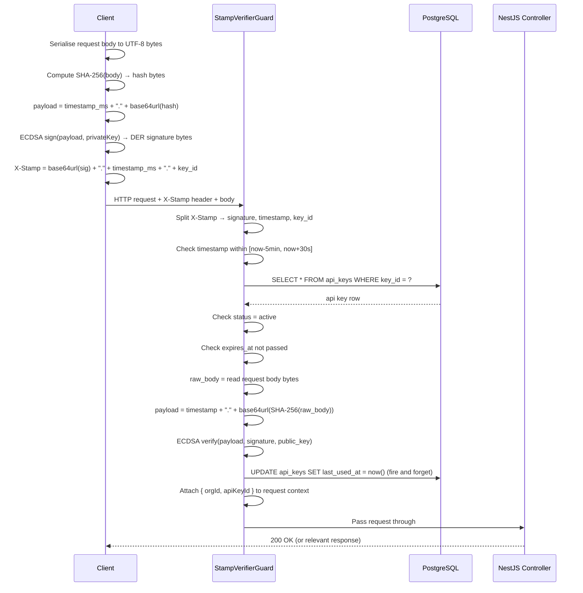
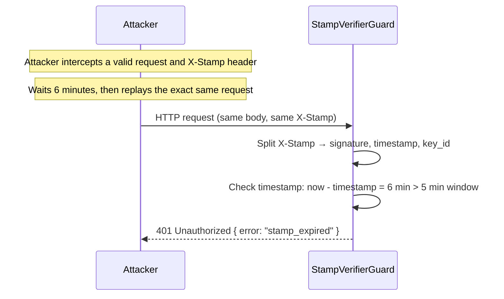
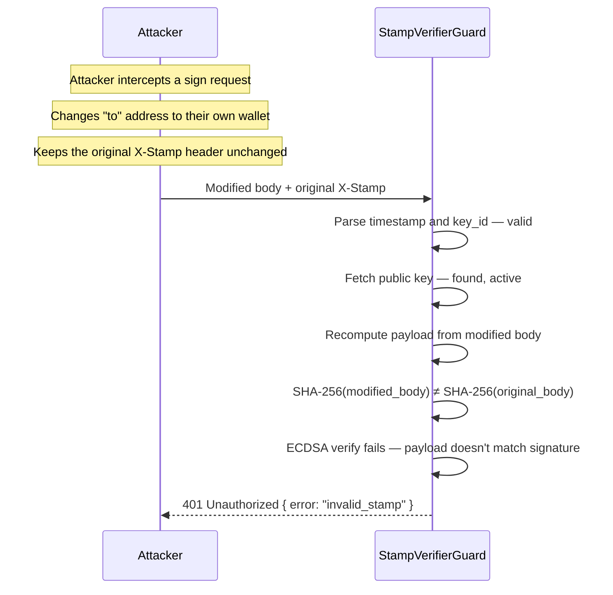

# WalletMVP — Stamp Authentication

This document explains the stamp-based authentication system used to protect
all WalletMVP API endpoints. It covers the concept, the cryptographic
construction, the header format, the full request/response lifecycle, replay
protection, schema requirements, and edge cases.

---

## What is a stamp?

A stamp is a **cryptographic signature over the request body and a timestamp**,
produced by the API caller using their P-256 private key and sent in the
`X-Stamp` HTTP header.

The server verifies the stamp using the **public key** stored in the
`api_keys` table. The private key never leaves the caller — it is never sent
over the wire. A valid stamp proves two things simultaneously:

1. **Authentication** — the caller possesses the private key paired with the
   registered public key.
2. **Integrity** — the request body has not been modified since the caller
   signed it.

This is different from a conventional API key (a static secret in a header),
which only proves the caller knows a secret, and says nothing about whether
the request body was tampered with in transit.

---

## Why stamps instead of API keys?

| Property | Static API key | Stamp |
|---|---|---|
| Replay protection | ✗ Stolen key works forever | ✓ Timestamp baked into signature |
| Body integrity | ✗ Body can be modified in transit | ✓ Signature covers the body |
| Key exposure | ✗ Key is sent on every request | ✓ Private key never leaves caller |
| Revocation granularity | ✗ Revoke the whole key | ✓ Same — but replay window limits damage |
| Implementation complexity | Low | Medium |

The stamp model is used by Turnkey (the inspiration for WalletMVP), AWS
SigV4, and the WebAuthn standard. It is the right choice for a custody
platform where the operations being authorised have real financial impact.

---

## Key pair and key ID

Each organisation creates one or more API key pairs on their own machine:

- **Private key** — P-256 (secp256r1), generated and kept by the client. Never
  sent to WalletMVP. Used to sign stamps.
- **Public key** — sent to WalletMVP once during key registration
  (`POST /organisations/:id/api-keys`) in PEM format. Stored in `api_keys.public_key`.
- **Key ID** — a short, URL-safe identifier for the key pair. The client
  generates this and registers it alongside the public key. Stored in
  `api_keys.key_id`. Included in every stamp so the server knows which
  public key to use for verification, without needing a separate header.

---

## The stamp construction

### What gets signed

The client signs the following payload (a UTF-8 string):

```
<unix_timestamp_ms>.<base64url(SHA-256(request_body))>
```

- **`unix_timestamp_ms`** — current time in milliseconds since epoch, as a
  plain integer string. Millisecond precision reduces the chance of two
  requests sharing the same timestamp and therefore the same signed payload.
- **`base64url(SHA-256(request_body))`** — the SHA-256 hash of the raw
  request body bytes, encoded as base64url (no padding). Hashing the body
  before signing keeps the signed payload small regardless of body size, and
  is standard practice (same approach as JWT and AWS SigV4).
- For requests with no body (e.g. GET requests), the body is treated as an
  empty byte array. `SHA-256("")` is a fixed known value — this is fine.

### The signature

The client signs the payload string using:
- Algorithm: **ECDSA with P-256 (secp256r1) and SHA-256** — also written as
  `ES256` in JWT terminology.
- The signature is DER-encoded (the default output from most P-256 libraries).
- The signature bytes are encoded as **base64url** (no padding).

### The X-Stamp header format

```
X-Stamp: <base64url(signature)>.<unix_timestamp_ms>.<key_id>
```

Three dot-separated parts:

| Part | Example | Description |
|---|---|---|
| `signature` | `MEYCIQDx...` | base64url DER-encoded ECDSA signature |
| `timestamp` | `1718000000000` | Unix time in milliseconds |
| `key_id` | `ak_prod_abc123` | Registered key ID from `api_keys.key_id` |

Dots are used as separators because none of base64url, integers, or typical
key ID characters contain dots.

---

## Server-side verification steps

The `StampVerifierGuard` performs these checks in order. Any failure returns
`401 Unauthorized` with a reason string. No step is skipped.

**Step 1 — Parse the header**

Split `X-Stamp` on `.` into exactly three parts: signature, timestamp, key_id.
If the header is missing or malformed, reject immediately.

**Step 2 — Timestamp check (replay protection)**

Parse the timestamp as an integer. Reject if:
- The timestamp is more than **5 minutes in the past** (replay window).
- The timestamp is more than **30 seconds in the future** (clock skew
  tolerance — prevents clients with slightly fast clocks from being rejected,
  while still catching obviously fabricated future timestamps).

This window means a stolen stamp can only be replayed within 5 minutes of
the original request. After that it is permanently invalid.

**Step 3 — Fetch the API key**

Look up `api_keys WHERE key_id = ?`. Reject if:
- No row found.
- `status != 'active'` (revoked key).
- `expires_at` is set and is in the past (expired key).

**Step 4 — Reconstruct the signed payload**

Read the raw request body bytes. Compute:
```
payload = timestamp + "." + base64url(SHA-256(body))
```

This must be byte-for-byte identical to what the client signed. The guard
reads the raw body before any JSON parsing — framework-level body parsing
must not consume or re-serialise the body before this step.

**Step 5 — Verify the signature**

Decode the base64url signature. Verify it against the payload string using
the public key from `api_keys.public_key` and the ES256 algorithm. Reject if
verification fails.

**Step 6 — Update last_used_at**

On success, fire-and-forget update `api_keys SET last_used_at = now()
WHERE key_id = ?`. This does not block the request.

**Step 7 — Attach context to the request**

Attach `orgId` and `apiKeyId` to the NestJS request object so downstream
controllers and services can access them without re-querying.

---

## Sequence diagrams

### API key registration (one-time setup per key pair)



---

### Normal authenticated request



---

### Rejected stamp — replay attack



---

### Rejected stamp — body tampering



---

## Schema additions to api_keys

The existing `api_keys` table already has the necessary columns. Two columns
should be added to support the stamp system fully:

### Add: `created_by_key_id`

```
created_by_key_id  uuid  [ref: > api_keys.id, note: 'Which API key registered this key — null for the first (bootstrap) key']
```

**Why:** Audit trail for key creation. If a key is later found to be
malicious, you need to know which key created it. For the very first key
registered by an org (the bootstrap key — created via a one-time root token
flow, see below), this is null.

### Add: `scopes`

```
scopes  text[]  [not null, default: '{*}', note: 'Array of permitted actions e.g. {wallet:sign, wallet:create} or {*} for all']
```

**Why:** Not all API keys should be able to do everything. A key used by an
automated signing service should not be able to create new wallets or revoke
other keys. Scopes allow per-key permission restriction. The `*` wildcard
means unrestricted, which is the default for MVP simplicity but can be
narrowed per key.

Scope values (initial set):
- `*` — all actions (default)
- `wallet:create` — derive new wallet addresses
- `wallet:sign` — sign transactions
- `wallet:read` — read wallet details and history
- `policy:write` — create and delete policies
- `key:write` — create and revoke API keys

---

## Bootstrap: registering the first key

There is a chicken-and-egg problem: stamp verification requires a registered
API key, but to register the first API key you have no key to stamp with.

Resolution: `POST /organisations/:id/api-keys` accepts a **one-time
bootstrap token** on the `X-Bootstrap-Token` header instead of `X-Stamp`,
but only if the org has zero existing `active` api_keys rows. This token is
a random secret generated by the platform when the org is created and
delivered out-of-band (e.g. shown once in a dashboard or sent by email).

Once the first key is registered, `X-Bootstrap-Token` is permanently
rejected for that org. All subsequent key management operations require a
valid stamp from an existing active key with `key:write` scope.

The bootstrap token is stored hashed (SHA-256) in an `organisations` column:

```
bootstrap_token_hash  varchar(64)  [note: 'SHA-256 of the one-time bootstrap token — nulled after first key is registered']
```

After the first API key is registered, the platform sets
`bootstrap_token_hash = null`, permanently disabling the bootstrap flow for
that org.

---

## Error responses

All failures return `401 Unauthorized` with a JSON body:

| `error` field | Cause |
|---|---|
| `missing_stamp` | `X-Stamp` header absent |
| `malformed_stamp` | Header does not parse into three parts |
| `stamp_expired` | Timestamp older than 5 minutes |
| `stamp_future` | Timestamp more than 30 seconds in the future |
| `key_not_found` | `key_id` not in `api_keys` table |
| `key_revoked` | `status = revoked` |
| `key_expired` | `expires_at` is in the past |
| `insufficient_scope` | Key does not have the scope required by this route |
| `invalid_stamp` | Signature verification failed |

Deliberately vague error codes are avoided — leaking which step failed is not
a meaningful security risk for ECDSA (unlike timing attacks on HMAC), and
precise errors make debugging much easier for integrating organisations.

---

## Client implementation notes

These notes are for documentation of what the integrating organisation's
client must do. Not NestJS implementation.

1. Generate a P-256 key pair. Store the private key in a secure location
   (HSM, KMS, or at minimum an encrypted secrets store).
2. Register the public key via `POST /organisations/:id/api-keys` using the
   bootstrap token for the first key.
3. For every subsequent request:
   - Serialise the request body to a UTF-8 JSON string with consistent key
     ordering (or whatever serialisation your client uses — the server will
     hash whatever bytes it receives, so the client must sign the same bytes
     it sends).
   - Get current Unix time in milliseconds.
   - Compute `payload = timestamp + "." + base64url(SHA-256(body_bytes))`.
   - ECDSA-sign the payload string (as UTF-8 bytes) with the private key.
   - DER-encode the signature and base64url-encode it.
   - Set `X-Stamp: <sig>.<timestamp>.<key_id>`.
4. For GET requests with no body: sign over an empty body.
   `SHA-256("") = e3b0c44298fc1c149afbf4c8996fb92427ae41e4649b934ca495991b7852b855`.
   The payload becomes `<timestamp>.47DEQpj8HBSa-_TImW-5JCeuQeRkm5NMpJWZG3hSuFU`.

---

## Security properties

| Property | Achieved | How |
|---|---|---|
| Caller authentication | ✓ | ECDSA signature verifiable only with matching private key |
| Body integrity | ✓ | SHA-256 of body is inside the signed payload |
| Replay protection | ✓ | 5-minute timestamp window; expired stamps permanently invalid |
| Future-stamp protection | ✓ | 30-second forward clock skew tolerance |
| Key revocation | ✓ | `status=revoked` check on every request |
| Key expiry | ✓ | `expires_at` check on every request |
| Per-key permissions | ✓ | `scopes` array checked per route |
| Key lineage audit | ✓ | `created_by_key_id` traces which key created each key |
| Bootstrap lockout | ✓ | `bootstrap_token_hash` nulled after first key registered |
| Private key never transmitted | ✓ | Only signature and public key ever leave the client |
