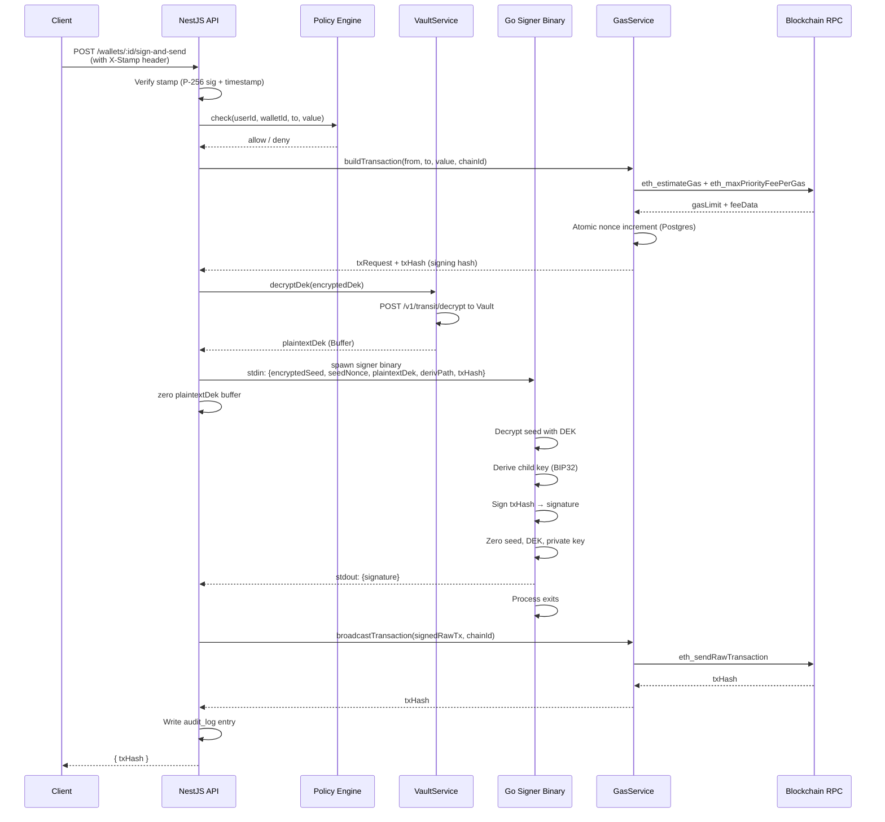
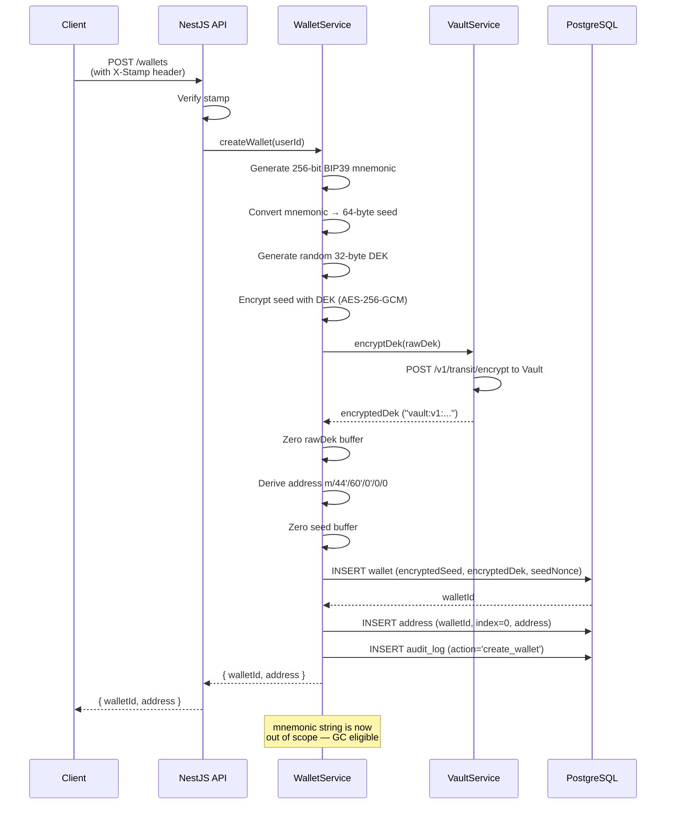

# WalletMVP — Build Phases & Tasks

Detailed breakdown of every phase, what you are building, why each decision
was made, and what "done" looks like for each task.

---

## Phase 1 — Foundation (Week 1–2)

**Goal:** Running local environment with Vault, Postgres, and a bare NestJS
scaffold. Nothing security-critical yet — just get the plumbing right.

---

### 1.1 — Docker Compose environment

**What:** A `docker-compose.yml` that starts HashiCorp Vault and PostgreSQL
with correct configuration for local development.

**Why:** You need Vault in production mode (not dev mode) even locally, so
you practise the real unseal ceremony. Dev mode auto-unseals and loses all
data on restart — it will hide bugs in your startup/unseal handling.

**Vault configuration details:**

- Storage backend: `file` (writes to a local volume — fine for dev/staging)
- Listener: TCP on `0.0.0.0:8200`, TLS disabled locally (enable for prod)
- `IPC_LOCK` capability: prevents Vault's memory from being swapped to disk
  by the OS — important because Vault holds decryption keys in memory

**PostgreSQL configuration details:**

- Create a dedicated database (`walletmvp`) and a limited app role
- The app role should NOT have superuser privileges
- Enable `pgaudit` extension for query-level audit logging (optional but good)

**Done when:** `docker-compose up` starts both services cleanly, Vault is
reachable at `localhost:8200`, and Postgres at `localhost:5432`.

---

### 1.2 — Vault initialisation and Shamir unseal ceremony

**What:** First-time setup of Vault using `vault operator init` with Shamir
secret sharing.

**Why this matters:** Vault's master encryption key is split into N shares
using Shamir's secret sharing algorithm. You choose a threshold K such that
any K-of-N shares can reconstruct the key. No single share is sufficient.
This mirrors Turnkey's Quorum Key provisioning — the difference is that
Turnkey's shares are submitted to a hardware enclave; yours are submitted to
a software process. The security principle is identical.

**Recommended split for solo dev MVP:** 3 shares, threshold 2.

- Store share 1 in your primary password manager
- Store share 2 in a secondary location (encrypted file, different device)
- Store share 3 in a printed backup in a physically secure location
- Store the root token separately — treat it like a nuclear launch code

**What happens at boot:** Every time Vault restarts, it comes up "sealed" —
it has data on disk but cannot decrypt it. You must provide at least 2 of 3
unseal keys before Vault will serve requests. Build a startup script that
automates unsealing (for dev only — in prod, unseal manually).

**Done when:** `vault status` shows `Sealed: false` and `Initialized: true`.

---

### 1.3 — NestJS monorepo scaffold

**What:** Set up the NestJS project using the monorepo workspace pattern
(`apps/` + `libs/`), with TypeScript strict mode, ESLint, and Prettier.

**Why monorepo:** The signing binary is Go, not TypeScript. The project has
distinct bounded contexts (wallet management, gas, policy, auth). A monorepo
keeps them versioned together without coupling their implementations.

**Module boundaries to create now (empty stubs):**

- `libs/vault` — VaultTransitService
- `libs/wallet` — WalletService, WalletRepository
- `libs/gas` — GasService, NonceRepository
- `libs/policy` — PolicyEngine
- `libs/auth` — StampVerifier, AuthGuard

**Configuration:** Use `@nestjs/config` with a validated config schema
(class-validator) for all environment variables. Never hardcode Vault tokens,
DB credentials, or RPC URLs. Every secret must come from environment.

**Done when:** `npm run start:dev` starts without errors and `GET /health`
returns 200.

---

### 1.4 — PostgreSQL schema migrations

**What:** Create the initial database schema covering all tables the MVP needs.

**Tables to create:**

`users` — one row per API consumer. Stores their P-256 public key for stamp
verification. No passwords stored.

`wallets` — one row per wallet. Stores ONLY ciphertext: the AES-256-GCM
encrypted seed and the Vault-wrapped DEK. Never stores a plaintext seed or
private key.

`addresses` — derived addresses per wallet per index. Cached after first
derivation so you don't re-derive on every lookup.

`nonces` — per-wallet, per-chain transaction counter. Used by the nonce
manager to prevent collisions under concurrent requests.

`audit_log` — append-only event log. Every signing event, policy denial,
wallet creation, and address derivation is recorded here.

**Critical constraint:** After creating the schema, revoke UPDATE and DELETE
on `audit_log` from the application database role. The app can only INSERT.
This makes the audit log tamper-resistant from within the application.

**Migration tool:** Use TypeORM migrations or a simple SQL migration runner
(`node-pg-migrate`). Do not use TypeORM `synchronize: true` — it can
silently drop columns.

**Done when:** All tables exist, the app role has correct privileges, and a
migration command can be run idempotently.

---

## Phase 2 — Key Management (Week 2–3)

**Goal:** Working wallet creation. A `POST /wallets` call should generate a
BIP39 seed, encrypt it, wrap the DEK in Vault, and persist only ciphertext.
No plaintext key material should ever touch the database or a log file.

See `VAULT.md` and `KEY_MANAGEMENT.md` for the full deep-dive on this phase.

---

### 2.1 — VaultTransitService

**What:** A NestJS injectable service that wraps Vault's Transit HTTP API.
Provides two core methods: `encryptDek(rawBuffer)` and `decryptDek(ciphertext)`.

**Why a dedicated service:** Vault token management, retry logic, error
handling, and token rotation all live here. No other service calls the Vault
API directly. This enforces a single choke point for all key operations —
easier to audit, easier to rotate credentials.

**AppRole authentication:** The service must use Vault AppRole, not the root
token. At startup it exchanges a RoleID + SecretID for a short-lived Vault
token (1-hour TTL), then rotates it before expiry. The root token never
appears in application code.

**Error handling:** If Vault is sealed or unreachable, the service must throw
a specific error that propagates up and results in a 503 — not a 500 that
might leak internal details.

**Done when:** The service can encrypt a buffer and round-trip decrypt it,
verified by a unit test against a running Vault dev instance.

---

### 2.2 — BIP39 seed generation

**What:** Generate a 256-bit (24-word) BIP39 mnemonic using audited libraries.

**Library choice:** `@scure/bip39` — audited, minimal dependencies, uses
the platform's CSPRNG (`crypto.getRandomValues` in Node). Do not use
`ethers.js` for this — it bundles far more than you need and increases supply
chain risk.

**Entropy source:** Node's `crypto.randomBytes(32)` which reads from
`/dev/urandom`. On Linux this is cryptographically secure. You are not using
hardware-certified entropy (unlike Turnkey's NSM), but `/dev/urandom` is
the correct choice for a software implementation.

**What NOT to do:**

- Do not log the mnemonic under any circumstances
- Do not return the mnemonic to the API caller (they get a wallet ID and address only)
- Do not store the mnemonic anywhere — only the encrypted seed

**Done when:** `createWallet()` generates a mnemonic internally, converts it
to a 64-byte seed, and the mnemonic string goes out of scope and is GC'd.

---

### 2.3 — Per-wallet DEK generation and envelope encryption

**What:** For every new wallet, generate a fresh random 32-byte AES-256 key
(the DEK). Use it to encrypt the BIP39 seed with AES-256-GCM. Then wrap the
DEK with Vault Transit.

**Why per-wallet DEK (not a single global DEK):**
If you used one DEK for all wallets, a single DEK exposure compromises every
user's seed. Per-wallet DEKs mean blast radius is always exactly one wallet.
This is Turnkey's approach with per-organization key material.

**AES-256-GCM details:**

- Key: 32 random bytes (the DEK)
- Nonce (IV): 12 random bytes, generated fresh for every encryption
- The authentication tag (16 bytes) must be stored alongside the ciphertext
- Store: `nonce || ciphertext || auth_tag` as a single base64 string

**What goes into Postgres:**

- `encrypted_seed`: base64(nonce + ciphertext + auth_tag)
- `encrypted_dek`: the Vault Transit ciphertext string (`vault:v1:...`)
- Never: the raw seed, the raw DEK, or the mnemonic

**Zeroing memory:** After encrypting and before returning from `createWallet`,
explicitly call `.fill(0)` on any Buffer holding the raw seed or DEK. Node's
GC does not guarantee when memory is released or zeroed. This is a
defence-in-depth measure — if a memory dump occurs, the window where keys are
visible is minimised.

**Done when:** After `createWallet()` completes, Postgres contains only
ciphertext, and a test confirms you can decrypt the seed back using the stored
encrypted DEK and a live Vault instance.

---

### 2.4 — Address derivation and caching

**What:** After generating and encrypting the seed, derive the first Ethereum
address (`m/44'/60'/0'/0/0`) for display and return it to the caller.

**Library:** `@scure/bip32` for BIP32 HD key derivation + Viem's
`privateKeyToAddress` for the address.

**Caching strategy:** Store the derived address in the `addresses` table
(wallet_id, derivation_index, address). On subsequent calls to get the
address, return the cached value — do not decrypt the seed again just to
re-derive a known address. The public address is not sensitive and can be
stored in plaintext.

**Derivation path convention:**

- Base path per wallet: `m/44'/60'/0'/0` (Ethereum BIP44)
- Index appended per account: `m/44'/60'/0'/0/0`, `m/44'/60'/0'/0/1`, etc.
- The wallet row stores the base path; individual account indexes are passed
  at signing time

**Done when:** `POST /wallets` returns `{ walletId, address }` and the
address is a valid EIP-55 checksummed Ethereum address.

---

## Phase 3 — Signing Service (Week 3–4)

**Goal:** Transaction signing happens in an isolated Go process, not in the
NestJS API. The raw private key exists only in that process's memory and is
zeroed before the process exits. Only the signature leaves the signing process.

---

### 3.1 — Go binary design

**What:** A standalone Go binary (`cmd/signer/main.go`) that reads a JSON
payload from stdin, performs signing, writes the signature to stdout, and exits.

**Why Go, not TypeScript:**

- Go gives explicit control over memory layout and zeroing (`make([]byte, n)`,
  then `for i := range buf { buf[i] = 0 }`)
- No garbage collector indirection — you zero the key bytes directly
- The `go-ethereum/crypto` package is the canonical, battle-tested Ethereum
  signing library
- A compiled binary is harder to tamper with than a Node.js script

**Why stdin/stdout (not HTTP):**

- stdin/stdout pipes are OS-level in-memory channels — nothing is written to disk
- The signing process has no network socket, so it cannot exfiltrate key material
- No state persists between invocations — each signing request spawns a fresh process

**Process lifecycle:** NestJS spawns the binary with `child_process.spawn`,
sends the JSON payload to stdin, closes stdin, reads stdout, and waits for
the process to exit. The process must exit after every single signing request.
Do not keep a long-running signer process.

**Done when:** The Go binary can be invoked with a test payload on the command
line and produces a valid Ethereum signature that Viem can verify.

---

### 3.2 — Inter-process communication design

**What:** Define exactly what data NestJS sends to the Go binary and what it
receives back.

**Input (JSON via stdin):**

- `encrypted_seed` — base64 of the AES-256-GCM ciphertext+tag
- `seed_nonce` — base64 of the 12-byte GCM nonce
- `plaintext_dek` — base64 of the DEK (decrypted from Vault by NestJS)
- `deriv_path` — full BIP32 path, e.g. `m/44'/60'/0'/0/0`
- `tx_hash` — hex string of the 32-byte Keccak256 hash to sign
- `chain_id` — integer

**Output (JSON via stdout):**

- `signature` — hex string of the 65-byte Ethereum signature (r+s+v)
- `error` — string, present only on failure

**Security note on passing the plaintext DEK:** The DEK is decrypted by
NestJS (via Vault) before being passed to the Go binary via the OS pipe.
This means the plaintext DEK exists briefly in two process memories: NestJS
and the Go signer. This is the honest limitation of not having a TEE. The
mitigation is: NestJS zeros the DEK buffer immediately after writing to stdin,
and the Go binary zeros it immediately after decrypting the seed.

**Done when:** A full round-trip test passes — NestJS spawns the binary, sends
a valid payload, and receives a verifiable Ethereum signature.

---

### 3.3 — Stamp-based request authentication

**What:** Every incoming HTTP request must carry a `X-Stamp` header containing
a base64-encoded JSON object with a P-256 signature over the request body and
a timestamp.

**Why stamps (not JWT or session cookies):**
JWTs are bearer tokens — anyone who intercepts one can use it until expiry.
Stamps are tied to the specific request body and timestamp, so they cannot be
replayed and cannot be used for a different request. This is exactly what
Turnkey calls "stamps" and why they mandate it. It provides request-level
integrity, not just session-level authentication.

**Stamp structure:**

```
X-Stamp: base64(JSON({
  publicKey: "hex-encoded P-256 public key",
  signature: "base64 P-256 signature over SHA256(timestamp + body)",
  timestamp: 1234567890123   // Unix ms
}))
```

**Replay prevention:** The API rejects any stamp where the timestamp is more
than 5 minutes old. Optionally, store recently seen stamp hashes in a Redis
set (or Postgres) with a 5-minute TTL to prevent within-window replays.

**NestJS implementation:** A Guard (`StampAuthGuard`) that runs before every
controller method. It extracts the header, decodes it, verifies the P-256
signature using Node's `crypto.createVerify`, checks the timestamp, and
attaches the user to the request.

**Done when:** Requests without a valid stamp receive 401. Requests with a
replayed stamp (same body, same timestamp) receive 401.

---

## Phase 4 — Gas, Nonce, and Broadcast (Week 4–5)

**Goal:** A complete end-to-end flow: receive a signing request, pass it
through policy, sign it in the Go binary, assemble the signed transaction,
and broadcast it to the network. Return the transaction hash to the caller.

---

### 4.1 — GasService with EIP-1559 fee estimation

**What:** A NestJS service that uses Viem to estimate gas limits and EIP-1559
fee parameters for a given transaction.

**EIP-1559 parameters (what you need to fill in):**

- `gas` — the gas limit (how many units the tx is allowed to consume)
- `maxFeePerGas` — the maximum total fee per gas unit you will pay
- `maxPriorityFeePerGas` — the tip to the block proposer

**Gas limit strategy:** Call `eth_estimateGas` on the RPC node, then apply
a 20% buffer (`estimate * 120 / 100` in bigint arithmetic — never use
floating point for gas). The buffer absorbs minor estimation errors and
state changes between estimation and inclusion.

**Fee estimation strategy:** Call `eth_maxPriorityFeePerGas` for the tip,
and `eth_getBlockByNumber("pending")` for the base fee, then set
`maxFeePerGas = baseFee * 2 + maxPriorityFeePerGas`. The 2x multiplier on
the base fee means your transaction remains valid across several blocks of
base fee fluctuation, which is important during volatile periods.

**Free RPC providers to use:**

- Ankr: `https://rpc.ankr.com/eth` — no API key, 30 req/s
- Alchemy: `https://eth-mainnet.g.alchemy.com/v2/YOUR_KEY` — 300M CU/month free
- Tenderly: excellent for testnet — has simulation API for dry-runs

**Use Viem's `fallback` transport** to chain multiple RPC providers. If the
primary is slow or fails, Viem automatically tries the next one.

**Done when:** Given a transaction object, GasService returns a complete set
of EIP-1559 parameters with a sensible gas limit and fees.

---

### 4.2 — Nonce manager

**What:** A PostgreSQL-backed per-wallet, per-chain nonce counter that
atomically increments to prevent nonce collisions under concurrent requests.

**Why this is non-trivial:** Ethereum requires transactions to be submitted
with sequential nonces (0, 1, 2, …) per sender address. If two transactions
are prepared simultaneously, both might read nonce=5, both submit nonce=5,
and one will fail with "nonce too low". This is one of the most common bugs
in wallet backends.

**The atomic solution:** A single SQL statement using `INSERT ... ON CONFLICT
DO UPDATE ... RETURNING` inside a serialisable transaction. This is equivalent
to a compare-and-swap at the database level — no race condition possible.

**On-chain sync:** On service startup, and periodically, call
`eth_getTransactionCount(address, "latest")` for each active wallet and take
`MAX(db_nonce, onchain_nonce)`. This handles cases where the service
restarts mid-flight, or transactions are submitted by other means.

**Rollback on failure:** If a transaction fails to broadcast (not to be
confused with failing on-chain), decrement the nonce back. If the RPC
returns a "nonce too low" error, sync from chain and retry.

**Done when:** Two simultaneous signing requests for the same wallet produce
two different nonces, verified by a concurrent integration test.

---

### 4.3 — Transaction assembly and broadcast

**What:** Assemble the fully signed raw transaction from the unsigned tx
parameters and the signature from the Go binary, then broadcast it.

**Transaction assembly steps:**

1. Build the unsigned transaction object (from, to, value, data, nonce,
   gas, maxFeePerGas, maxPriorityFeePerGas, chainId, type: 'eip1559')
2. Compute the signing hash: `keccak256(RLP-encode(unsigned_tx))`
3. Send to Go binary → receive `r`, `s`, `v` components
4. Inject signature into the transaction object
5. RLP-encode the signed transaction → raw hex string
6. Call `eth_sendRawTransaction(rawHex)` → receive tx hash

**Viem's role:** Viem's `serializeTransaction` handles the RLP encoding for
both the unsigned tx (to produce the signing hash) and the signed tx (to
produce the raw broadcast payload). Do not implement RLP encoding yourself.

**Error handling:**

- `nonce too low` → sync nonce from chain, retry once
- `insufficient funds for gas` → return a user-facing error with the shortfall
- `gas too low` → increase buffer and retry once
- `replacement transaction underpriced` → bump fees by 10% and retry

**Done when:** `POST /wallets/:id/sign-and-send` successfully sends a test
transaction on Sepolia testnet and returns a transaction hash that appears
on a block explorer.

---

### 4.4 — Full signing flow: sequence

The following describes the complete request lifecycle for a signing request,
from client to blockchain:



---

## Phase 5 — Policy Engine (Post-MVP, Week 5–6)

**Goal:** Evaluate configurable rules before any signing request reaches
the key management layer. Denied requests never touch the Go binary or Vault.

---

### 5.1 — Rule evaluator

**What:** A service that takes a proposed transaction and evaluates it against
a set of stored rules for the wallet/organisation. Returns allow or deny with
a reason.

**Rule types to implement (in order of priority):**

`allowlist` — the destination address must be in a pre-approved list. If
the wallet has an allowlist and the `to` address is not on it, deny.
This is the single most valuable policy for preventing draining attacks.

`max_value_per_tx` — the transaction value (in wei) must not exceed a
configured limit. Prevents a compromised API key from draining a wallet
in one transaction.

`daily_spend_limit` — sum of all transaction values in the last 24 hours
must not exceed a configured limit. Requires querying the audit log.

`time_lock` — signing is only permitted between configured hours (e.g.
08:00–20:00 UTC). Prevents off-hours exfiltration.

`cooldown` — a minimum time must have elapsed since the last signing event
for this wallet. Prevents rapid sequential draining.

**Storage:** Rules are stored as rows in a `policies` table (wallet_id,
rule_type, parameters as JSONB). Multiple rules can apply to one wallet —
all must pass for the request to proceed.

**Done when:** A wallet with an allowlist correctly denies a transaction to
an address not on the list, and the denial is recorded in the audit log.

---

### 5.2 — Wallet creation flow: sequence



---

## Summary: what each phase delivers

| Phase | Deliverable                                 | Risk addressed               |
| ----- | ------------------------------------------- | ---------------------------- |
| 1     | Running Vault + Postgres + NestJS scaffold  | Dev environment parity       |
| 2     | Wallet creation with envelope encryption    | Plaintext keys in DB         |
| 3     | Isolated Go signing binary + stamp auth     | Plaintext keys in API memory |
| 4     | Gas estimation + nonce manager + broadcast  | Nonce collisions, failed txs |
| 5     | Policy engine with allowlist + spend limits | Compromised API key attack   |
