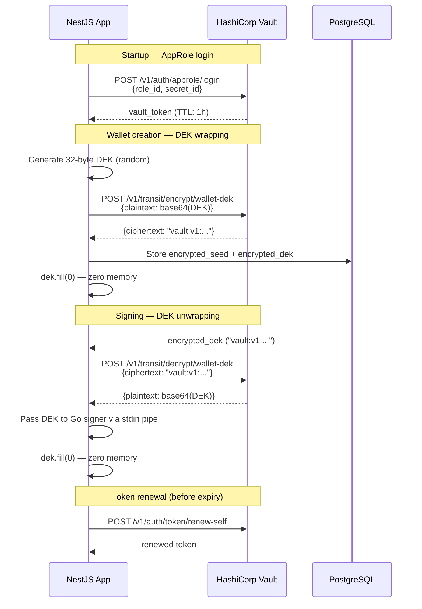

# HashiCorp Vault — Setup, Concepts, and Usage

This document explains how HashiCorp Vault fits into WalletMVP, exactly what
it does and does not do, how to configure it from scratch, and how the
application interacts with it at runtime.

---

## What Vault is and what role it plays here

HashiCorp Vault is a self-hosted secrets management and encryption service.
In WalletMVP, it plays one specific and narrow role: it is the **Key
Encryption Key (KEK) store**.

Your application never asks Vault to store wallet seeds or private keys.
Instead, it asks Vault to encrypt a small symmetric key (the DEK — Data
Encryption Key) and later to decrypt it. Vault's Transit secrets engine
handles these cryptographic operations on data-in-transit and does not store
the data itself. The actual encrypted wallet seed lives in PostgreSQL; Vault
just controls access to the key that can unlock it.

This is the same separation of concerns that AWS KMS provides, except Vault
is entirely free, open-source, and runs on your own machine or server.

---

## The Transit secrets engine

The Transit secrets engine is Vault's "encryption as a service" feature.
You enable it once, create a named key ring, and then call HTTP endpoints to
encrypt or decrypt arbitrary data. The encryption key itself never leaves
Vault — your application only ever sees ciphertext or plaintext payloads.

**What this means in practice:**

1. You generate a random 32-byte DEK in your application
2. You call `POST /v1/transit/encrypt/wallet-dek` with the DEK as base64 input
3. Vault returns a ciphertext string in the format `vault:v1:...`
4. You store that ciphertext string in PostgreSQL alongside the encrypted seed
5. At signing time, you call `POST /v1/transit/decrypt/wallet-dek` with the ciphertext
6. Vault returns the original 32-byte DEK as base64 plaintext
7. Your application uses it to decrypt the seed, then immediately zeros it

The `vault:v1:` prefix encodes the key version. When you rotate the Transit
key, old ciphertext (v1) can still be decrypted, and new encryptions produce
`vault:v2:...` ciphertext. This is how Vault handles key rotation without
requiring you to re-encrypt all existing data at once.

---

## Vault's internal architecture (what is actually protecting the KEK)

Vault encrypts all of its own data before writing it to the storage backend
(in this project, the filesystem). It uses its own master encryption key to
do this. The master key is what you must protect.

To protect the master key, Vault uses **Shamir's secret sharing**. At
initialisation time, Vault generates the master key, splits it into N shares
using Shamir's algorithm, and discards the master key itself. Only the shares
are given to you. To reconstruct the master key, any K-of-N shares must be
combined. This happens in memory during the unseal ceremony.

**The unseal ceremony:**

Every time Vault starts, it is "sealed" — its master key is not in memory.
It can read encrypted data from disk but cannot decrypt any of it. You must
provide at least K unseal keys (in any order) to unseal it. Vault combines
the shares, reconstructs the master key in memory, and begins serving
requests. The master key is never written to disk.

This is the free software equivalent of Turnkey's Quorum Key. The difference:
Turnkey's shares are submitted to a hardware enclave (AWS Nitro) via a
cryptographically attested channel. Yours are submitted to a Vault process
over HTTPS. The cryptographic principle is identical; the hardware trust
boundary is not present.

---

## Initial setup: step by step

### Step 1 — Start Vault

Run Vault in production mode (not dev mode). Dev mode auto-unseals and loses
data on restart — it is only suitable for testing individual API calls.

Production mode configuration requires:
- A persistent storage backend (file backend on a Docker volume is sufficient for MVP)
- A TCP listener (disable TLS locally for simplicity; enable it for any non-local deployment)
- `disable_mlock = false` — Vault will lock its memory pages so they cannot be swapped to disk

### Step 2 — Initialise Vault (one-time only)

Run `vault operator init` with your chosen share parameters.

For a solo developer MVP, use **3 shares with a threshold of 2**. This means
you need any 2 of your 3 keys to unseal, so you can afford to lose access to
one key temporarily without losing access to Vault forever.

Vault will output:
- 3 unseal keys (long base64 strings)
- 1 root token (a long random string starting with `hvs.`)

**Store these immediately and carefully:**
- Unseal key 1 → primary password manager
- Unseal key 2 → secondary location (different password manager, encrypted file on a different device)
- Unseal key 3 → printed and stored physically (or another secure location)
- Root token → treat like a database root password. Store it, then never use it in application code.

You will never see these values again after this step. If you lose more than
1 unseal key (or the root token before you set up AppRole), you cannot
recover your Vault data.

### Step 3 — Unseal Vault

After initialisation, Vault is still sealed. Run `vault operator unseal`
three times (or two times if threshold=2), providing a different unseal key
each time. After the threshold is met, Vault unseals and begins serving requests.

For local development, you can automate this in a startup script that reads
the unseal keys from environment variables. Do not do this in production —
unseal manually.

### Step 4 — Enable the Transit secrets engine

Authenticate with the root token (just this once), then enable Transit:

```
vault secrets enable transit
```

This creates the Transit engine at the path `/v1/transit/`. Now create the
key ring that will be used to wrap wallet DEKs:

```
vault write -f transit/keys/wallet-dek type=aes256-gcm96
```

The key type `aes256-gcm96` uses AES-256 in GCM mode, the same algorithm
used to encrypt the seeds in the application layer. The key ring starts at
version 1 and auto-increments on rotation.

Configure the key ring to disallow plaintext backup and disallow export.
These settings prevent anyone (including someone with Vault admin access)
from exporting the raw key material:

```
vault write transit/keys/wallet-dek/config \
  exportable=false \
  allow_plaintext_backup=false
```

### Step 5 — Configure AppRole authentication

The application must not authenticate to Vault using the root token. Create
a dedicated AppRole with the minimum necessary permissions.

**Create a policy** that grants only encrypt and decrypt on the wallet-dek key:

```hcl
# wallet-policy.hcl
path "transit/encrypt/wallet-dek" {
  capabilities = ["update"]
}
path "transit/decrypt/wallet-dek" {
  capabilities = ["update"]
}
```

Write it to Vault:
```
vault policy write wallet-api wallet-policy.hcl
```

**Enable AppRole auth** and create the role:
```
vault auth enable approle
vault write auth/approle/role/wallet-api \
  token_policies="wallet-api" \
  token_ttl=1h \
  token_max_ttl=24h \
  secret_id_ttl=10m \
  secret_id_num_uses=1
```

Retrieve the RoleID (not secret) — this can be stored in your app's config:
```
vault read auth/approle/role/wallet-api/role-id
```

Generate a SecretID (sensitive, treat like a password):
```
vault write -f auth/approle/role/wallet-api/secret-id
```

The application exchanges RoleID + SecretID for a short-lived Vault token on
startup. The SecretID is single-use and expires in 10 minutes — so even if
intercepted, it cannot be reused after the application has consumed it.

---

## Runtime interaction: how the application uses Vault

### At startup

1. The application reads `VAULT_ROLE_ID` and `VAULT_SECRET_ID` from environment
2. It calls `POST /v1/auth/approle/login` with both values
3. Vault returns a token with a 1-hour TTL
4. The application stores this token in memory and uses it for all subsequent calls
5. Before the token expires, the application calls `vault token renew` to extend it

### At wallet creation

1. The application generates a 32-byte DEK in memory
2. It base64-encodes the DEK and calls `POST /v1/transit/encrypt/wallet-dek`
   with the base64 as the `plaintext` field
3. Vault returns `{ "data": { "ciphertext": "vault:v1:..." } }`
4. The application stores this ciphertext string in Postgres
5. The application zeros the raw DEK buffer

### At signing time

1. The application reads the `encrypted_dek` string from Postgres
2. It calls `POST /v1/transit/decrypt/wallet-dek` with the ciphertext
3. Vault returns `{ "data": { "plaintext": "<base64 DEK>" } }`
4. The application passes this base64 DEK to the Go signing binary via stdin
5. The application zeros the decoded DEK buffer immediately after writing to stdin

### Vault interaction sequence



---

## Key rotation

One significant advantage of Vault Transit over a hardcoded encryption key is
built-in key rotation. When you rotate the `wallet-dek` key ring:

1. Call `vault write -f transit/keys/wallet-dek/rotate`
2. Vault creates a new key version (`v2`). All new encryptions use `v2`.
3. Old ciphertext (`vault:v1:...`) can still be decrypted — Vault remembers all versions
4. You can trigger a background job in your application that reads every
   `encrypted_dek`, decrypts it (Vault uses v1 to decrypt), re-encrypts it
   (Vault uses v2), and writes the new ciphertext back to Postgres
5. After all records are re-encrypted, you can set the minimum decryption
   version to `2`, which prevents decryption of any v1 ciphertext forever

This rotation procedure does not require decrypting and re-encrypting the
wallet seeds themselves — only the DEKs. This is the power of the two-layer
envelope encryption design.

---

## Vault audit log

Enable Vault's audit log to create a tamper-evident record of every encrypt
and decrypt call:

```
vault audit enable file file_path=/vault/logs/audit.log
```

Every Transit encrypt and decrypt call will be logged with the calling token,
timestamp, and key name (not the key material itself). This gives you an
independent record of every time a DEK was accessed, separate from your
application's audit log.

---

## What Vault does NOT protect you from

**Compromised host OS:** If an attacker has root on the machine running Vault,
they can attach a debugger to the Vault process and read its memory, including
the master key. Vault's `mlock` prevents swap but not an active attacker with
root. This is the fundamental gap vs. a hardware TEE.

**Stolen unseal keys:** If two or more of your Shamir shares are compromised,
an attacker can unseal Vault on their own infrastructure. Protect the unseal
keys as you would a root private key.

**Compromised Vault token:** If an attacker intercepts your application's
Vault token, they can call the Transit decrypt endpoint directly. The 1-hour
TTL limits exposure. Use TLS on the Vault listener for anything beyond localhost.

**Vault process memory dump:** The plaintext DEK returned by the decrypt
endpoint passes through your application's Node.js process. Any memory dump
of that process at the right moment exposes the DEK. The mitigation is to
minimise the window: zero the buffer immediately after writing it to the Go
binary's stdin pipe.
